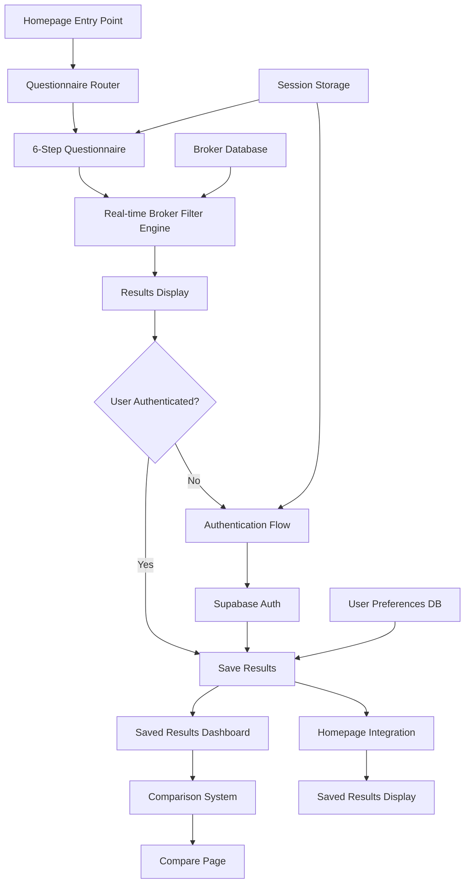
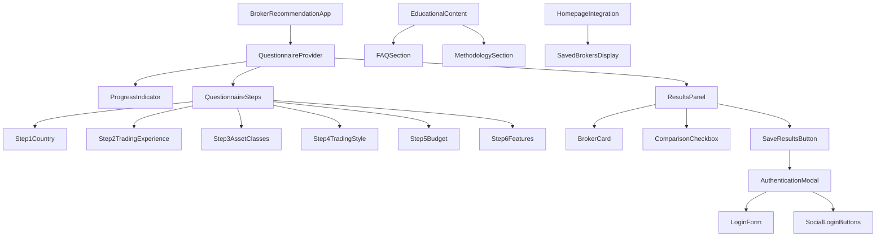

# Design Document

## Overview

The Broker Recommendation Flow Update introduces a sophisticated questionnaire-driven broker recommendation system that guides users through a 6-step process to find personalized broker matches. The system combines real-time filtering, progressive disclosure, and seamless authentication to create an engaging user experience that increases conversion rates and user satisfaction.

The design leverages React Hook Form for robust form state management, Supabase for authentication and data persistence, and a reactive architecture that provides instant feedback as users make selections. The system is built to be scalable, maintainable, and accessible while providing a smooth user journey from initial interest to saved recommendations.

## Architecture

### High-Level System Architecture



### Component Architecture



## Components and Interfaces

### Core Components

#### 1. BrokerRecommendationFlow Component
```typescript
interface BrokerRecommendationFlowProps {
  onComplete?: (results: BrokerRecommendationResult) => void;
  initialStep?: number;
  preserveProgress?: boolean;
}

interface BrokerRecommendationResult {
  selectedBrokers: Broker[];
  questionnaireResponses: QuestionnaireResponses;
  timestamp: Date;
  userId?: string;
}
```

#### 2. QuestionnaireProvider Context
```typescript
interface QuestionnaireContextValue {
  currentStep: number;
  responses: QuestionnaireResponses;
  filteredBrokers: Broker[];
  isLoading: boolean;
  errors: Record<string, string>;
  
  // Actions
  setCurrentStep: (step: number) => void;
  updateResponse: (step: number, response: any) => void;
  nextStep: () => void;
  previousStep: () => void;
  resetQuestionnaire: () => void;
}

interface QuestionnaireResponses {
  step1: { country: string };
  step2: { experience: TradingExperience; tradingFrequency: string };
  step3: { assetClasses: AssetClass[] };
  step4: { tradingStyle: TradingStyle; riskTolerance: RiskLevel };
  step5: { budget: BudgetRange; depositAmount: number };
  step6: { features: BrokerFeature[]; platforms: TradingPlatform[] };
}
```

#### 3. Individual Step Components
```typescript
interface StepProps {
  onNext: () => void;
  onPrevious: () => void;
  isValid: boolean;
  response: any;
  onResponseChange: (response: any) => void;
}

// Step 1: Country Selection
interface Step1Props extends StepProps {
  response: { country: string };
  countries: Country[];
}

// Step 2-6: Multi-select with checkboxes
interface MultiSelectStepProps extends StepProps {
  options: SelectOption[];
  response: { selections: string[] };
  allowMultiple: boolean;
}
```

#### 4. Real-time Results Panel
```typescript
interface ResultsPanelProps {
  brokers: Broker[];
  isLoading: boolean;
  selectedForComparison: string[];
  onToggleComparison: (brokerId: string) => void;
  onSaveResults: () => void;
  canSave: boolean;
}

interface BrokerCardProps {
  broker: Broker;
  isSelected: boolean;
  onToggleSelection: (brokerId: string) => void;
  showComparisonCheckbox: boolean;
}
```

#### 5. Authentication Components
```typescript
interface AuthenticationModalProps {
  isOpen: boolean;
  onClose: () => void;
  onSuccess: (user: User) => void;
  redirectAfterAuth?: string;
}

interface SocialLoginButtonProps {
  provider: 'google' | 'facebook';
  onSuccess: (user: User) => void;
  onError: (error: AuthError) => void;
  redirectTo?: string;
}
```

### Data Models

#### Broker Model
```typescript
interface Broker {
  id: string;
  name: string;
  logo: string;
  rating: number;
  reviewCount: number;
  
  // Filtering criteria
  supportedCountries: string[];
  assetClasses: AssetClass[];
  minDeposit: number;
  tradingPlatforms: TradingPlatform[];
  regulators: Regulator[];
  
  // Display information
  highlights: string[];
  pros: string[];
  cons: string[];
  spreadsFrom: number;
  
  // Metadata
  featured: boolean;
  lastUpdated: Date;
}
```

#### User Preferences Model
```typescript
interface UserPreferences {
  id: string;
  userId: string;
  questionnaireResponses: QuestionnaireResponses;
  recommendedBrokers: string[]; // Broker IDs
  savedAt: Date;
  updatedAt: Date;
  
  // Metadata
  version: number; // For questionnaire versioning
  source: 'questionnaire' | 'manual';
}
```

#### Session Storage Model
```typescript
interface QuestionnaireSession {
  responses: Partial<QuestionnaireResponses>;
  currentStep: number;
  filteredBrokers: string[]; // Broker IDs
  selectedForComparison: string[];
  timestamp: Date;
  expiresAt: Date;
}
```

## Data Models

### Database Schema (Supabase)

#### Users Table (extends Supabase auth.users)
```sql
-- Additional user profile data
CREATE TABLE user_profiles (
  id UUID REFERENCES auth.users(id) PRIMARY KEY,
  created_at TIMESTAMP WITH TIME ZONE DEFAULT NOW(),
  updated_at TIMESTAMP WITH TIME ZONE DEFAULT NOW(),
  
  -- Optional profile fields
  first_name TEXT,
  last_name TEXT,
  country TEXT,
  trading_experience TEXT,
  
  -- Preferences
  email_notifications BOOLEAN DEFAULT true,
  marketing_consent BOOLEAN DEFAULT false
);
```

#### Broker Recommendations Table
```sql
CREATE TABLE broker_recommendations (
  id UUID DEFAULT gen_random_uuid() PRIMARY KEY,
  user_id UUID REFERENCES auth.users(id) ON DELETE CASCADE,
  
  -- Questionnaire data
  questionnaire_responses JSONB NOT NULL,
  questionnaire_version INTEGER DEFAULT 1,
  
  -- Results
  recommended_broker_ids TEXT[] NOT NULL,
  total_matches INTEGER NOT NULL,
  
  -- Metadata
  created_at TIMESTAMP WITH TIME ZONE DEFAULT NOW(),
  updated_at TIMESTAMP WITH TIME ZONE DEFAULT NOW(),
  
  -- Indexes
  CONSTRAINT valid_broker_ids CHECK (array_length(recommended_broker_ids, 1) > 0)
);

-- Indexes for performance
CREATE INDEX idx_broker_recommendations_user_id ON broker_recommendations(user_id);
CREATE INDEX idx_broker_recommendations_created_at ON broker_recommendations(created_at DESC);
```

#### Broker Comparisons Table
```sql
CREATE TABLE broker_comparisons (
  id UUID DEFAULT gen_random_uuid() PRIMARY KEY,
  user_id UUID REFERENCES auth.users(id) ON DELETE CASCADE,
  recommendation_id UUID REFERENCES broker_recommendations(id) ON DELETE CASCADE,
  
  -- Comparison data
  broker_ids TEXT[] NOT NULL,
  comparison_criteria JSONB,
  
  -- Metadata
  created_at TIMESTAMP WITH TIME ZONE DEFAULT NOW(),
  
  -- Constraints
  CONSTRAINT valid_comparison_count CHECK (array_length(broker_ids, 1) BETWEEN 2 AND 5)
);
```

### API Interfaces

#### Broker Filtering Service
```typescript
interface BrokerFilterService {
  filterBrokers(criteria: FilterCriteria): Promise<Broker[]>;
  getBrokerById(id: string): Promise<Broker | null>;
  searchBrokers(query: string, filters?: FilterCriteria): Promise<Broker[]>;
}

interface FilterCriteria {
  country?: string;
  assetClasses?: AssetClass[];
  minDeposit?: number;
  maxMinDeposit?: number;
  tradingPlatforms?: TradingPlatform[];
  regulators?: Regulator[];
  features?: BrokerFeature[];
  
  // Sorting
  sortBy?: 'rating' | 'minDeposit' | 'name' | 'popularity';
  sortOrder?: 'asc' | 'desc';
  
  // Pagination
  limit?: number;
  offset?: number;
}
```

#### Recommendation Service
```typescript
interface RecommendationService {
  generateRecommendations(responses: QuestionnaireResponses): Promise<BrokerRecommendationResult>;
  saveRecommendations(userId: string, result: BrokerRecommendationResult): Promise<string>;
  getUserRecommendations(userId: string): Promise<UserPreferences[]>;
  updateRecommendations(id: string, result: BrokerRecommendationResult): Promise<void>;
  deleteRecommendations(id: string): Promise<void>;
}
```

## Error Handling

### Error Types and Handling Strategy

#### 1. Validation Errors
```typescript
interface ValidationError {
  field: string;
  message: string;
  code: 'required' | 'invalid' | 'min' | 'max';
}

// Handled at component level with React Hook Form
const validationSchema = yup.object({
  step1: yup.object({
    country: yup.string().required('Please select your country')
  }),
  step2: yup.object({
    experience: yup.string().required('Please select your trading experience'),
    tradingFrequency: yup.string().required('Please select your trading frequency')
  })
  // ... additional step validations
});
```

#### 2. Network and API Errors
```typescript
interface APIError {
  code: string;
  message: string;
  details?: any;
  retryable: boolean;
}

// Error boundary and retry logic
class BrokerRecommendationErrorBoundary extends React.Component {
  handleRetry = () => {
    // Implement retry logic with exponential backoff
  };
  
  render() {
    if (this.state.hasError) {
      return <ErrorFallback onRetry={this.handleRetry} />;
    }
    return this.props.children;
  }
}
```

#### 3. Authentication Errors
```typescript
interface AuthError {
  type: 'network' | 'invalid_credentials' | 'social_auth_failed' | 'session_expired';
  message: string;
  provider?: 'google' | 'facebook';
}

// Handled with user-friendly messages and retry options
const handleAuthError = (error: AuthError) => {
  switch (error.type) {
    case 'social_auth_failed':
      showToast(`${error.provider} login failed. Please try again.`);
      break;
    case 'session_expired':
      redirectToLogin();
      break;
    default:
      showToast('Authentication failed. Please try again.');
  }
};
```

#### 4. Data Persistence Errors
```typescript
// Session storage fallback for critical data
const saveToSessionStorage = (data: QuestionnaireSession) => {
  try {
    sessionStorage.setItem('questionnaire_session', JSON.stringify(data));
  } catch (error) {
    console.warn('Failed to save to session storage:', error);
  }
};

const loadFromSessionStorage = (): QuestionnaireSession | null => {
  try {
    const data = sessionStorage.getItem('questionnaire_session');
    return data ? JSON.parse(data) : null;
  } catch (error) {
    console.warn('Failed to load from session storage:', error);
    return null;
  }
};
```

## Testing Strategy

### Unit Testing
- **Components**: Test individual step components, form validation, and user interactions
- **Services**: Test broker filtering logic, recommendation algorithms, and API integrations
- **Utilities**: Test session storage, data transformation, and validation functions

### Integration Testing
- **Authentication Flow**: Test complete login/register flow with Supabase
- **Questionnaire Flow**: Test multi-step form progression and data persistence
- **Real-time Filtering**: Test broker filtering with various criteria combinations

### End-to-End Testing
- **Complete User Journey**: From homepage entry to saved recommendations
- **Authentication Scenarios**: Both authenticated and unauthenticated user flows
- **Cross-browser Compatibility**: Ensure consistent behavior across browsers

### Performance Testing
- **Real-time Filtering**: Ensure sub-500ms response times for broker filtering
- **Large Dataset Handling**: Test with full broker database (500+ brokers)
- **Concurrent Users**: Test system behavior under load

### Accessibility Testing
- **Keyboard Navigation**: Ensure all interactions are keyboard accessible
- **Screen Reader Compatibility**: Test with NVDA, JAWS, and VoiceOver
- **Color Contrast**: Verify WCAG 2.1 AA compliance
- **Focus Management**: Proper focus handling in multi-step flow

## Implementation Approach

### Phase 1: Core Questionnaire System
1. Set up React Hook Form with multi-step validation
2. Implement basic questionnaire components (Steps 1-6)
3. Create real-time broker filtering engine
4. Build results panel with broker cards

### Phase 2: Authentication Integration
1. Integrate Supabase authentication
2. Implement social login (Google, Facebook)
3. Create seamless auth flow with progress preservation
4. Build user session management

### Phase 3: Data Persistence and Comparison
1. Implement results saving to Supabase
2. Create comparison functionality
3. Build saved results dashboard
4. Integrate with homepage display

### Phase 4: Educational Content and Polish
1. Add FAQ and methodology sections
2. Implement comprehensive error handling
3. Add loading states and animations
4. Optimize performance and accessibility

### Phase 5: Testing and Optimization
1. Comprehensive testing suite
2. Performance optimization
3. Cross-browser testing
4. User acceptance testing

This design provides a robust foundation for implementing the Broker Recommendation Flow Update while maintaining scalability, performance, and user experience standards.