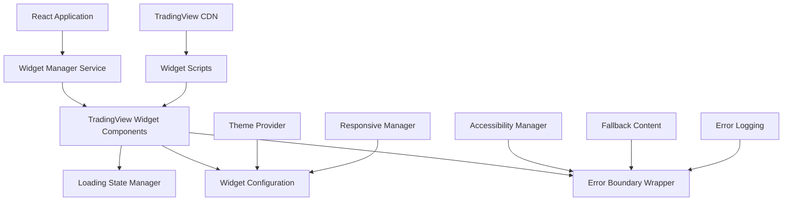

# Design Document

## Overview

The TradingView Widget Integration design provides a comprehensive solution for embedding live financial data throughout the BrokerAnalysis platform. This design replaces mock data with real-time market information using TradingView's extensive widget library, ensuring seamless integration with the existing React/TypeScript architecture while maintaining performance and accessibility standards.

## Architecture

### Widget Integration Architecture



### Component Hierarchy

```
src/components/widgets/
├── core/
│   ├── TradingViewWidget.tsx          # Base widget component
│   ├── WidgetErrorBoundary.tsx        # Error handling wrapper
│   ├── WidgetLoadingState.tsx         # Loading states
│   └── WidgetContainer.tsx            # Responsive container
├── charts/
│   ├── AdvancedChart.tsx              # Advanced real-time chart
│   ├── SymbolOverview.tsx             # Symbol overview widget
│   ├── MiniChart.tsx                  # Mini chart widget
│   ├── MarketOverview.tsx             # Market overview widget
│   └── StockMarket.tsx                # Stock market widget
├── heatmaps/
│   ├── StockHeatmap.tsx               # Stock heatmap
│   ├── CryptoHeatmap.tsx              # Crypto heatmap
│   ├── ETFHeatmap.tsx                 # ETF heatmap
│   ├── ForexHeatmap.tsx               # Forex heatmap
│   └── ForexCrossRates.tsx            # Forex cross rates
├── screeners/
│   ├── Screener.tsx                   # General screener
│   └── CryptocurrencyMarket.tsx       # Crypto market screener
├── news/
│   └── TopStories.tsx                 # News widget
├── calendars/
│   └── EconomicCalendar.tsx           # Economic calendar
└── index.ts                           # Barrel exports
```

## Components and Interfaces

### Core Widget Interface

```typescript
interface TradingViewWidgetProps {
  widgetType: WidgetType;
  symbol?: string;
  width?: number | string;
  height?: number | string;
  theme?: 'light' | 'dark';
  locale?: string;
  timezone?: string;
  autosize?: boolean;
  container_id?: string;
  onLoad?: () => void;
  onError?: (error: Error) => void;
  fallbackContent?: React.ReactNode;
  config?: Record<string, any>;
}

interface WidgetConfig {
  responsive: {
    breakpoints: {
      mobile: { width: number; height: number };
      tablet: { width: number; height: number };
      desktop: { width: number; height: number };
    };
  };
  theme: {
    colors: Record<string, string>;
    fonts: Record<string, string>;
  };
  accessibility: {
    ariaLabel: string;
    description: string;
  };
}
```

### Widget Manager Service

```typescript
class WidgetManager {
  private static instance: WidgetManager;
  private loadedScripts: Set<string> = new Set();
  private widgetInstances: Map<string, any> = new Map();

  async loadWidget(type: WidgetType, containerId: string, config: WidgetConfig): Promise<void>;
  unloadWidget(containerId: string): void;
  updateWidget(containerId: string, config: Partial<WidgetConfig>): void;
  getWidgetInstance(containerId: string): any;
  private loadScript(src: string): Promise<void>;
  private createWidget(type: WidgetType, containerId: string, config: WidgetConfig): void;
}
```

### Responsive Widget Container

```typescript
interface ResponsiveWidgetProps {
  children: React.ReactNode;
  minWidth?: number;
  minHeight?: number;
  aspectRatio?: number;
  breakpoints?: ResponsiveBreakpoints;
}

const ResponsiveWidgetContainer: React.FC<ResponsiveWidgetProps> = ({
  children,
  minWidth = 300,
  minHeight = 200,
  aspectRatio,
  breakpoints
}) => {
  // Implementation with useMediaQuery and dynamic sizing
};
```

## Data Models

### Widget Configuration Schema

```typescript
interface ChartWidgetConfig extends BaseWidgetConfig {
  symbol: string;
  interval: string;
  range: string;
  style: 'candles' | 'line' | 'bars';
  toolbar_bg: string;
  enable_publishing: boolean;
  hide_top_toolbar: boolean;
  hide_legend: boolean;
  save_image: boolean;
}

interface HeatmapWidgetConfig extends BaseWidgetConfig {
  dataSource: 'SPX500' | 'CRYPTO' | 'ETF' | 'FOREX';
  exchanges: string[];
  showSymbolLogo: boolean;
  colorTheme: 'light' | 'dark';
  hasTopBar: boolean;
  isTransparent: boolean;
}

interface CalendarWidgetConfig extends BaseWidgetConfig {
  colorTheme: 'light' | 'dark';
  isTransparent: boolean;
  width: number | string;
  height: number | string;
  utm_source: string;
  utm_medium: string;
  utm_campaign: string;
}
```

### Widget State Management

```typescript
interface WidgetState {
  isLoading: boolean;
  isLoaded: boolean;
  hasError: boolean;
  error?: Error;
  retryCount: number;
  lastUpdated?: Date;
}

interface WidgetStore {
  widgets: Record<string, WidgetState>;
  globalConfig: GlobalWidgetConfig;
  theme: 'light' | 'dark';
}
```

## Error Handling

### Error Boundary Implementation

```typescript
class WidgetErrorBoundary extends React.Component<WidgetErrorBoundaryProps, WidgetErrorBoundaryState> {
  constructor(props: WidgetErrorBoundaryProps) {
    super(props);
    this.state = { hasError: false, error: null, retryCount: 0 };
  }

  static getDerivedStateFromError(error: Error): WidgetErrorBoundaryState {
    return { hasError: true, error, retryCount: 0 };
  }

  componentDidCatch(error: Error, errorInfo: React.ErrorInfo) {
    // Log error to monitoring service
    this.logError(error, errorInfo);
  }

  handleRetry = () => {
    if (this.state.retryCount < 3) {
      this.setState(prevState => ({
        hasError: false,
        error: null,
        retryCount: prevState.retryCount + 1
      }));
    }
  };

  render() {
    if (this.state.hasError) {
      return (
        <WidgetErrorFallback
          error={this.state.error}
          onRetry={this.handleRetry}
          canRetry={this.state.retryCount < 3}
          fallbackContent={this.props.fallbackContent}
        />
      );
    }

    return this.props.children;
  }
}
```

### Error Types and Handling

```typescript
enum WidgetErrorType {
  SCRIPT_LOAD_FAILED = 'SCRIPT_LOAD_FAILED',
  WIDGET_INIT_FAILED = 'WIDGET_INIT_FAILED',
  NETWORK_ERROR = 'NETWORK_ERROR',
  INVALID_CONFIG = 'INVALID_CONFIG',
  CONTAINER_NOT_FOUND = 'CONTAINER_NOT_FOUND'
}

interface WidgetError extends Error {
  type: WidgetErrorType;
  widgetType: string;
  containerId: string;
  config?: any;
  retryable: boolean;
}
```

## Testing Strategy

### Unit Testing Approach

```typescript
// Widget component testing
describe('TradingViewWidget', () => {
  it('should render loading state initially', () => {
    render(<TradingViewWidget widgetType="advanced-chart" />);
    expect(screen.getByTestId('widget-loading')).toBeInTheDocument();
  });

  it('should handle script loading errors gracefully', async () => {
    // Mock script loading failure
    jest.spyOn(document, 'createElement').mockImplementation(() => {
      const script = document.createElement('script');
      setTimeout(() => script.onerror?.(new Event('error')), 100);
      return script;
    });

    render(<TradingViewWidget widgetType="advanced-chart" />);
    
    await waitFor(() => {
      expect(screen.getByTestId('widget-error')).toBeInTheDocument();
    });
  });
});
```

### Integration Testing

```typescript
// E2E testing with Playwright
test('TradingView widgets load correctly on tools page', async ({ page }) => {
  await page.goto('/tools');
  
  // Wait for widgets to load
  await page.waitForSelector('[data-testid="economic-calendar-widget"]');
  await page.waitForSelector('[data-testid="stock-heatmap-widget"]');
  
  // Verify widgets are interactive
  await page.click('[data-testid="heatmap-sector-filter"]');
  await expect(page.locator('.heatmap-updated')).toBeVisible();
});
```

## Performance Optimization

### Lazy Loading Strategy

```typescript
const LazyTradingViewWidget = React.lazy(() => 
  import('./TradingViewWidget').then(module => ({
    default: module.TradingViewWidget
  }))
);

const WidgetWithSuspense: React.FC<WidgetProps> = (props) => (
  <Suspense fallback={<WidgetSkeleton />}>
    <LazyTradingViewWidget {...props} />
  </Suspense>
);
```

### Script Loading Optimization

```typescript
class ScriptLoader {
  private static scriptCache = new Map<string, Promise<void>>();
  
  static async loadScript(src: string): Promise<void> {
    if (this.scriptCache.has(src)) {
      return this.scriptCache.get(src)!;
    }

    const promise = new Promise<void>((resolve, reject) => {
      const script = document.createElement('script');
      script.src = src;
      script.async = true;
      script.onload = () => resolve();
      script.onerror = () => reject(new Error(`Failed to load script: ${src}`));
      document.head.appendChild(script);
    });

    this.scriptCache.set(src, promise);
    return promise;
  }
}
```

## Widget Placement Strategy

### Homepage Integration

- **Hero Section**: Market Overview widget (980x400px)
- **Market Summary**: Stock Market widget showing top gainers/losers (100% width, 400px height)
- **Quick Stats**: Mini Chart widgets for major indices (300x200px each)

### Tools Landing Page

- **Economic Calendar**: Full-width Economic Calendar widget (100% width, 600px height)
- **Market Heatmaps**: Grid layout with Stock, Crypto, and ETF heatmaps (33% width each, 400px height)
- **Screeners**: Tabbed interface with Stock and Crypto screeners (100% width, 500px height)

### Broker Comparison Pages

- **Instrument Charts**: Advanced Real-Time Chart widgets for popular instruments (100% width, 500px height)
- **Market Data**: Symbol Overview widgets for broker-specific instruments (50% width, 300px height)

### News Section

- **Top Stories**: TradingView Top Stories widget (100% width, auto height)
- **Market News**: Filtered news widgets by category (100% width, 400px height)

### Mobile Responsive Breakpoints

```css
/* Mobile (320px - 768px) */
.widget-mobile {
  width: 100%;
  min-height: 300px;
}

/* Tablet (768px - 1024px) */
.widget-tablet {
  width: 100%;
  min-height: 400px;
}

/* Desktop (1024px+) */
.widget-desktop {
  width: 100%;
  min-height: 500px;
}
```

## Accessibility Implementation

### ARIA Labels and Descriptions

```typescript
const accessibilityConfig = {
  'advanced-chart': {
    ariaLabel: 'Interactive financial chart',
    description: 'Real-time price chart with technical analysis tools'
  },
  'economic-calendar': {
    ariaLabel: 'Economic events calendar',
    description: 'Upcoming economic events and announcements'
  },
  'stock-heatmap': {
    ariaLabel: 'Stock market heatmap',
    description: 'Visual representation of stock performance by color'
  }
};
```

### Keyboard Navigation Support

```typescript
const WidgetAccessibilityWrapper: React.FC<{ children: React.ReactNode }> = ({ children }) => {
  const handleKeyDown = (event: React.KeyboardEvent) => {
    if (event.key === 'Enter' || event.key === ' ') {
      // Handle widget interaction
    }
  };

  return (
    <div
      role="application"
      tabIndex={0}
      onKeyDown={handleKeyDown}
      aria-label="Financial data widget"
    >
      {children}
    </div>
  );
};
```

## Theme Integration

### Design System Integration

```typescript
const widgetThemeConfig = {
  light: {
    backgroundColor: 'rgb(255, 255, 255)',
    gridColor: 'rgba(42, 46, 57, 0.06)',
    textColor: 'rgb(19, 23, 34)',
    accentColor: 'rgb(41, 98, 255)',
    upColor: 'rgb(38, 166, 154)',
    downColor: 'rgb(239, 83, 80)'
  },
  dark: {
    backgroundColor: 'rgb(19, 23, 34)',
    gridColor: 'rgba(240, 243, 250, 0.06)',
    textColor: 'rgb(240, 243, 250)',
    accentColor: 'rgb(41, 98, 255)',
    upColor: 'rgb(38, 166, 154)',
    downColor: 'rgb(239, 83, 80)'
  }
};
```

This comprehensive design provides a robust foundation for integrating TradingView widgets throughout the BrokerAnalysis platform while maintaining performance, accessibility, and design consistency.