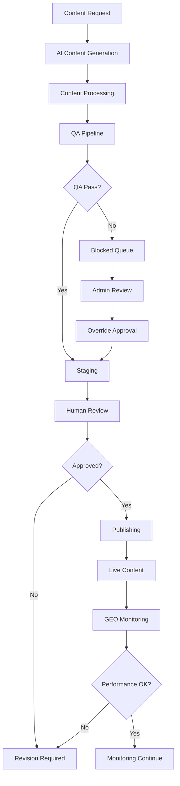

# AI Content Generator System - Product Requirements Document

## 1. Product Overview

The AI Content Generator System is a comprehensive SEO + GEO + Programmatic SEO platform that automatically generates high-quality, SEO-optimized content for the BrokerAnalysis platform. The system will programmatically create all pages identified in the complete site map including broker reviews, comparison pages, interactive tools, educational content, country-specific landing pages, and company information pages.

The system addresses the challenge of scaling content production while maintaining quality standards, enabling the creation of hundreds of broker review pages, comparison tools, and educational resources with automated QA validation and publishing workflows. The target is to achieve complete site coverage with AI-generated content that ranks well in search engines and provides value to users seeking broker information.

## 2. Core Features

### 2.1 User Roles

| Role                  | Registration Method | Core Permissions                                                                         |
| --------------------- | ------------------- | ---------------------------------------------------------------------------------------- |
| Content Manager       | Admin invitation    | Can create content generation requests, review generated content, approve for staging    |
| Content Administrator | System admin access | Full access to content generation, QA override, publishing controls, analytics dashboard |
| QA Reviewer           | Admin invitation    | Can review blocked content, provide feedback, approve content with remediation           |
| System Administrator  | Root access         | Full system configuration, AI provider management, security settings                     |

### 2.2 Feature Module

Our AI Content Generator system consists of the following main modules:

1. **Content Generation Engine**: AI-powered content creation, template processing, programmatic content population
2. **Quality Assurance Pipeline**: Automated QA checks, content validation, duplicate detection, readability analysis
3. **Publishing Workflow**: Staging management, approval gates, sitemap generation, llms.txt updates
4. **Admin Dashboard**: Content management interface, performance monitoring, bulk operations
5. **GEO Monitoring System**: Citation tracking, performance analytics, revision workflow automation
6. **Integration Layer**: Broker data integration, internal linking, existing site structure compatibility

### 2.3 Page Details

| Page Name                  | Module Name             | Feature description                                                                                         |
| -------------------------- | ----------------------- | ----------------------------------------------------------------------------------------------------------- |
| Content Generation Engine  | AI Provider Gateway     | Manage multiple AI providers (Groq, OpenRouter) with automatic fallback, health checking, cost optimization |
| Content Generation Engine  | Content Processor       | Transform raw AI content into structured sections, generate HTML fragments, optimize SEO metadata           |
| Content Generation Engine  | Template System         | Load and populate content templates for broker reviews, comparisons, landing pages, tools documentation     |
| Quality Assurance Pipeline | QA Runner               | Execute comprehensive quality checks including schema validation, keyword density, link validation          |
| Quality Assurance Pipeline | Content Validator       | Perform readability analysis, spell checking, accessibility validation, duplicate content detection         |
| Quality Assurance Pipeline | Blocking System         | Automatically block content that fails QA with detailed remediation steps and human override capability     |
| Publishing Workflow        | Staging Manager         | Handle content staging, versioning, revision tracking, approval workflows                                   |
| Publishing Workflow        | Publication Engine      | Move approved content to published state, update sitemap.xml, manage llms.txt entries                       |
| Publishing Workflow        | CI/CD Integration       | Automated GitHub Actions for QA checks, PR creation for approved content                                    |
| Admin Dashboard            | Content Management      | Interface for creating generation requests, reviewing blocked content, bulk operations                      |
| Admin Dashboard            | Analytics Dashboard     | Performance monitoring, content metrics, QA statistics, citation analytics                                  |
| Admin Dashboard            | Override Controls       | Manual approval system with user attribution, blocking reason display                                       |
| GEO Monitoring System      | Citation Monitor        | Track content citations in AI engines and search results, schedule monitoring jobs                          |
| GEO Monitoring System      | Performance Analytics   | Collect and analyze content performance metrics, generate improvement recommendations                       |
| GEO Monitoring System      | Revision Automation     | Automatically trigger content revisions based on citation performance thresholds                            |
| Integration Layer          | Broker Data Connector   | Integrate with existing extractedBrokers.json, maintain data consistency                                    |
| Integration Layer          | Internal Linking Engine | Generate automatic internal links to existing broker pages and directory structure                          |
| Integration Layer          | Style Integration       | Ensure generated content uses consistent Tailwind CSS styling and component patterns                        |

## 3. Core Process

### Content Generation Flow

1. **Content Request Submission**: Content managers submit generation requests with page type, keywords, broker data, and template specifications
2. **AI Content Generation**: System selects optimal AI provider, generates content using templates and programmatic data
3. **Content Processing**: Raw content is transformed into structured sections with SEO optimization and metadata generation
4. **Quality Assurance**: Automated QA pipeline validates content quality, checks for duplicates, validates links and accessibility
5. **Staging and Review**: Approved content moves to staging for human review, blocked content queues for remediation
6. **Publishing**: Approved content publishes to live site with sitemap updates and llms.txt entries
7. **Monitoring**: GEO monitoring tracks citation performance and triggers revision workflows as needed

### Admin Management Flow

1. **Dashboard Access**: Administrators access centralized dashboard for content management and monitoring
2. **Bulk Operations**: Process multiple content generation requests, review blocked content in batches
3. **Performance Monitoring**: Track system performance, content quality metrics, AI provider costs
4. **Override Management**: Review and approve blocked content with detailed reasoning and user attribution

## 4. User Interface Design

### 4.1 Design Style

* **Primary Colors**: Blue (#3B82F6) for primary actions, Green (#10B981) for success states, Red (#EF4444) for errors/blocking

* **Secondary Colors**: Gray (#6B7280) for secondary text, Light Gray (#F3F4F6) for backgrounds

* **Button Style**: Rounded corners (rounded-lg), solid fills for primary actions, outlined for secondary actions

* **Font**: Inter font family, 14px base size for body text, 16px for form inputs, 24px+ for headings

* **Layout Style**: Card-based design with clean spacing, top navigation with sidebar for admin functions

* **Icons**: Heroicons for consistency, status indicators with color coding (green=approved, yellow=pending, red=blocked)

### 4.2 Page Design Overview

| Page Name           | Module Name          | UI Elements                                                                                                                                       |
| ------------------- | -------------------- | ------------------------------------------------------------------------------------------------------------------------------------------------- |
| Content Generation  | Request Form         | Multi-step form with page type selection, keyword inputs, broker selection dropdown, template preview. Blue primary buttons, validation messaging |
| Admin Dashboard     | Overview Cards       | Grid layout with metric cards showing generation stats, QA pass rates, publishing queue. Color-coded status indicators                            |
| Content Review      | Blocked Content List | Table layout with content previews, blocking reasons, action buttons. Red highlighting for critical issues                                        |
| QA Results          | Validation Details   | Expandable sections for each QA check, progress bars for scores, detailed remediation steps with code examples                                    |
| Analytics Dashboard | Performance Charts   | Interactive charts using Chart.js, filterable date ranges, drill-down capabilities for detailed metrics                                           |
| Publishing Queue    | Content Pipeline     | Kanban-style board showing content stages (Generated → QA → Staging → Published), drag-and-drop functionality                                     |

### 4.3 Responsiveness

The system is desktop-first with mobile-adaptive design for admin dashboard access. Touch interaction optimization is included for tablet usage by content managers. Responsive breakpoints at 768px (tablet) and 1024px (desktop) with collapsible sidebar navigation on smaller screens.

## 5. Content Types and Templates

### 5.1 Broker Review Pages

**Template Structure**: Introduction, regulation overview, fees analysis, platform features, pros/cons, user experience, conclusion
**Required Data**: Broker name, regulatory status, fee structure, platform details, user ratings
**SEO Requirements**: Primary keyword in title and first 60 words, 6+ citable statements, 3-4 internal links
**Word Count**: 2000-3000 words minimum

### 5.2 Comparison Pages

**Template Structure**: Introduction, comparison methodology, side-by-side analysis, winner selection, detailed breakdown
**Required Data**: Broker list, comparison criteria, scoring methodology, feature matrix
**SEO Requirements**: Comparison keywords, structured data for reviews, table of contents
**Word Count**: 1500-2500 words minimum

### 5.3 Interactive Tools

**Template Structure**: Tool description, usage instructions, interactive calculator, results interpretation, related resources
**Required Data**: Calculator parameters, broker fee data, formula explanations
**SEO Requirements**: Tool-specific keywords, how-to structured data, step-by-step guides
**Word Count**: 800-1200 words minimum

### 5.4 Educational Content

**Template Structure**: Learning objectives, concept explanation, practical examples, key takeaways, further reading
**Required Data**: Topic outline, example scenarios, related broker features
**SEO Requirements**: Educational keywords, FAQ structured data, internal linking to relevant tools
**Word Count**: 1000-2000 words minimum

### 5.5 Country-Specific Landing Pages

**Template Structure**: Country overview, regulatory environment, available brokers, local considerations, getting started guide
**Required Data**: Country regulations, broker availability, local requirements
**SEO Requirements**: Geo-specific keywords, local business structured data, country-specific internal links
**Word Count**: 1200-1800 words minimum

## 6. Technical Integration Requirements

### 6.1 AI Provider Integration

* **Primary Provider**: Groq API with high-performance models for content generation

* **Secondary Provider**: OpenRouter API with multiple model access for fallback scenarios

* **Fallback Strategy**: Automatic provider switching on failure, cached template responses for emergencies

* **Cost Management**: Provider selection based on cost optimization and performance metrics

### 6.2 Quality Assurance Pipeline

* **Schema Validation**: Automatic JSON-LD structured data validation for all content types

* **SEO Compliance**: Keyword density analysis, meta tag validation, internal/external link requirements

* **Content Quality**: Readability scoring (Flesch-Kincaid), spell checking, grammar validation

* **Duplicate Detection**: Semantic similarity analysis with 0.8 threshold for blocking

* **Accessibility**: WCAG compliance checking for generated HTML content

### 6.3 Publishing and Distribution

* **Staging System**: Content review and approval workflow with version control

* **Sitemap Management**: Automatic sitemap.xml updates with new content entries

* **AI Crawler Support**: llms.txt file management for AI engine discovery

* **CI/CD Integration**: GitHub Actions for automated QA and deployment workflows

### 6.4 Performance and Monitoring

* **Caching Strategy**: AI response caching, template caching, QA result caching with TTL management

* **Performance Metrics**: Generation time tracking, success rate monitoring, cost analysis

* **Citation Monitoring**: Track content citations in search engines and AI responses

* **Analytics Dashboard**: Real-time performance monitoring with alerting for issues

## 7. Success Metrics and KPIs

### 7.1 Content Generation Metrics

* **Generation Success Rate**: Target 95% successful content generation without manual intervention

* **QA Pass Rate**: Target 85% of generated content passing automated QA on first attempt

* **Publishing Velocity**: Target 50+ pages published per day with full QA validation

* **Content Quality Score**: Average readability score of 60+ (Flesch-Kincaid)

### 7.2 SEO Performance Metrics

* **Search Engine Indexing**: 90% of published content indexed within 7 days

* **Citation Rate**: 25% of content cited in AI engine responses within 30 days

* **Organic Traffic Growth**: 40% increase in organic traffic to generated pages

* **Keyword Ranking**: 70% of target keywords ranking in top 50 search results

### 7.3 System Performance Metrics

* **Average Generation Time**: Under 5 minutes per page including QA validation

* **System Uptime**: 99.5% availability for content generation services

* **AI Provider Response Time**: Average under 30 seconds for content generation requests

* **Error Rate**: Less than 2% unrecoverable errors in content generation pipeline

### 7.4 Business Impact Metrics

* **Content Coverage**: 100% coverage of identified broker reviews and comparison pages

* **Cost Efficiency**: 80% reduction in content production costs compared to manual creation

* **Time to Market**: 90% reduction in time from content request to publication

* **User Engagement**: 25% increase in page views and time on site for generated content

