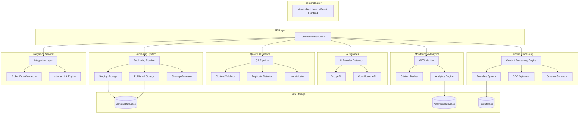
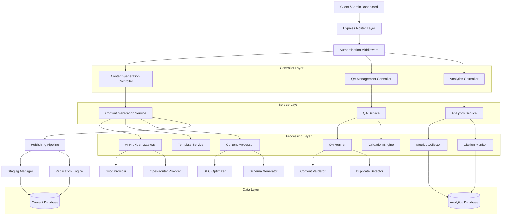
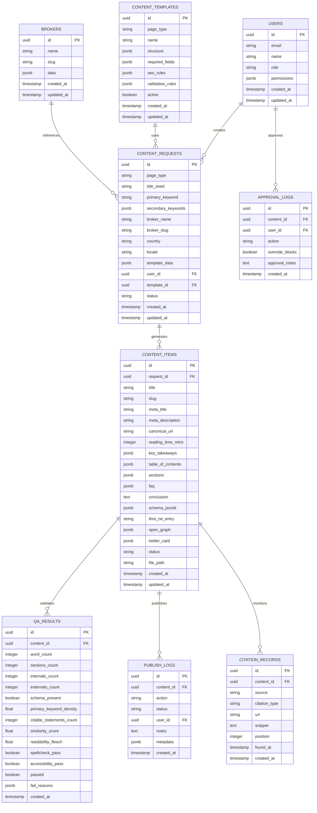

# AI Content Generator System - Technical Architecture Document

## 1. Architecture Design



## 2. Technology Description

* **Frontend**: React\@18 + TypeScript + Tailwind CSS + Vite

* **Backend**: Node.js + Express\@4 + TypeScript

* **Database**: Supabase (PostgreSQL) for content metadata and analytics

* **File Storage**: Local file system for content JSON and HTML fragments

* **AI Providers**: Groq API + OpenRouter API with fallback mechanisms

* **Caching**: Redis for AI response caching and performance optimization

* **Testing**: Jest + React Testing Library + Playwright for E2E

* **CI/CD**: GitHub Actions for automated QA and deployment

* **Monitoring**: Custom analytics with performance tracking

## 3. Route Definitions

| Route                              | Purpose                                                    |
| ---------------------------------- | ---------------------------------------------------------- |
| /admin/content-generator           | Main admin dashboard for content generation and management |
| /admin/content-generator/create    | Content generation request form with template selection    |
| /admin/content-generator/queue     | Publishing queue showing content in various stages         |
| /admin/content-generator/blocked   | Review interface for blocked content with QA results       |
| /admin/content-generator/analytics | Performance dashboard with generation and citation metrics |
| /admin/content-generator/settings  | System configuration for AI providers and QA parameters    |
| /admin/content-generator/templates | Template management interface for content types            |
| /admin/content-generator/bulk      | Bulk operations interface for processing multiple requests |

## 4. API Definitions

### 4.1 Core API

**Content Generation**

```
POST /api/content-generator/generate
```

Request:

| Param Name          | Param Type | isRequired | Description                                                                         |
| ------------------- | ---------- | ---------- | ----------------------------------------------------------------------------------- |
| page\_type          | string     | true       | Type of content (blog\_post, broker\_review, comparison, landing\_page, tools\_doc) |
| title\_seed         | string     | true       | Base title for content generation                                                   |
| primary\_keyword    | string     | true       | Primary SEO keyword                                                                 |
| secondary\_keywords | string\[]  | true       | Array of secondary keywords                                                         |
| broker\_name        | string     | false      | Broker name for broker-specific content                                             |
| broker\_slug        | string     | false      | Broker URL slug                                                                     |
| country             | string     | false      | Country for geo-specific content                                                    |
| locale              | string     | true       | Content locale (en-US, en-GB, etc.)                                                 |
| template\_data      | object     | false      | Additional template-specific data                                                   |

Response:

| Param Name               | Param Type | Description                                                |
| ------------------------ | ---------- | ---------------------------------------------------------- |
| success                  | boolean    | Generation success status                                  |
| content\_id              | string     | Unique identifier for generated content                    |
| status                   | string     | Content status (generated, qa\_pending, blocked, approved) |
| blocking\_reasons        | string\[]  | Array of QA blocking reasons if applicable                 |
| estimated\_publish\_time | string     | ISO timestamp for estimated publication                    |

Example Request:

```json
{
  "page_type": "broker_review",
  "title_seed": "Interactive Brokers Review",
  "primary_keyword": "Interactive Brokers review",
  "secondary_keywords": ["IBKR review", "Interactive Brokers fees", "IB trading platform"],
  "broker_name": "Interactive Brokers",
  "broker_slug": "interactive-brokers",
  "locale": "en-US",
  "template_data": {
    "regulation": "SEC, FINRA",
    "founded": "1978",
    "headquarters": "Greenwich, CT"
  }
}
```

**Content Status Check**

```
GET /api/content-generator/status/{content_id}
```

Response:

| Param Name     | Param Type | Description                              |
| -------------- | ---------- | ---------------------------------------- |
| content\_id    | string     | Content identifier                       |
| status         | string     | Current content status                   |
| qa\_results    | object     | Detailed QA check results                |
| publish\_ready | boolean    | Whether content is ready for publication |
| created\_at    | string     | ISO timestamp of creation                |
| updated\_at    | string     | ISO timestamp of last update             |

**Content Approval**

```
POST /api/content-generator/approve/{content_id}
```

Request:

| Param Name       | Param Type | isRequired | Description                                          |
| ---------------- | ---------- | ---------- | ---------------------------------------------------- |
| action           | string     | true       | Approval action (approve, reject, request\_revision) |
| override\_blocks | boolean    | false      | Whether to override QA blocks                        |
| approval\_notes  | string     | false      | Notes from reviewer                                  |
| user\_id         | string     | true       | ID of approving user                                 |

**Bulk Content Generation**

```
POST /api/content-generator/bulk
```

Request:

| Param Name  | Param Type | isRequired | Description                          |
| ----------- | ---------- | ---------- | ------------------------------------ |
| requests    | object\[]  | true       | Array of content generation requests |
| batch\_name | string     | true       | Name for the batch operation         |
| priority    | string     | false      | Batch priority (low, normal, high)   |

**Analytics and Metrics**

```
GET /api/content-generator/analytics
```

Query Parameters:

| Param Name  | Param Type | isRequired | Description                           |
| ----------- | ---------- | ---------- | ------------------------------------- |
| start\_date | string     | false      | Start date for analytics (ISO format) |
| end\_date   | string     | false      | End date for analytics (ISO format)   |
| page\_type  | string     | false      | Filter by content type                |
| status      | string     | false      | Filter by content status              |

Response:

| Param Name          | Param Type | Description                      |
| ------------------- | ---------- | -------------------------------- |
| generation\_stats   | object     | Content generation statistics    |
| qa\_metrics         | object     | Quality assurance metrics        |
| performance\_data   | object     | System performance metrics       |
| citation\_analytics | object     | GEO monitoring and citation data |

## 5. Server Architecture Diagram



## 6. Data Model

### 6.1 Data Model Definition



### 6.2 Data Definition Language

**Content Requests Table**

```sql
-- Create content_requests table
CREATE TABLE content_requests (
    id UUID PRIMARY KEY DEFAULT gen_random_uuid(),
    page_type VARCHAR(50) NOT NULL CHECK (page_type IN ('blog_post', 'broker_review', 'comparison', 'landing_page', 'tools_doc')),
    title_seed VARCHAR(255) NOT NULL,
    primary_keyword VARCHAR(255) NOT NULL,
    secondary_keywords JSONB NOT NULL DEFAULT '[]',
    broker_name VARCHAR(255),
    broker_slug VARCHAR(255),
    country VARCHAR(10),
    locale VARCHAR(10) NOT NULL DEFAULT 'en-US',
    template_data JSONB DEFAULT '{}',
    user_id UUID NOT NULL,
    template_id UUID,
    status VARCHAR(50) NOT NULL DEFAULT 'pending' CHECK (status IN ('pending', 'processing', 'generated', 'qa_pending', 'blocked', 'approved', 'published', 'failed')),
    created_at TIMESTAMP WITH TIME ZONE DEFAULT NOW(),
    updated_at TIMESTAMP WITH TIME ZONE DEFAULT NOW()
);

-- Create indexes
CREATE INDEX idx_content_requests_status ON content_requests(status);
CREATE INDEX idx_content_requests_page_type ON content_requests(page_type);
CREATE INDEX idx_content_requests_user_id ON content_requests(user_id);
CREATE INDEX idx_content_requests_created_at ON content_requests(created_at DESC);
```

**Content Items Table**

```sql
-- Create content_items table
CREATE TABLE content_items (
    id UUID PRIMARY KEY DEFAULT gen_random_uuid(),
    request_id UUID NOT NULL REFERENCES content_requests(id) ON DELETE CASCADE,
    title VARCHAR(255) NOT NULL,
    slug VARCHAR(255) NOT NULL UNIQUE,
    meta_title VARCHAR(255) NOT NULL,
    meta_description TEXT NOT NULL,
    canonical_url VARCHAR(500) NOT NULL,
    reading_time_mins INTEGER NOT NULL DEFAULT 0,
    key_takeaways JSONB DEFAULT '[]',
    table_of_contents JSONB DEFAULT '[]',
    sections JSONB NOT NULL DEFAULT '[]',
    faq JSONB DEFAULT '[]',
    conclusion TEXT,
    schema_jsonld JSONB DEFAULT '{}',
    llms_txt_entry TEXT,
    open_graph JSONB DEFAULT '{}',
    twitter_card JSONB DEFAULT '{}',
    status VARCHAR(50) NOT NULL DEFAULT 'draft' CHECK (status IN ('draft', 'staging', 'published', 'archived')),
    file_path VARCHAR(500),
    created_at TIMESTAMP WITH TIME ZONE DEFAULT NOW(),
    updated_at TIMESTAMP WITH TIME ZONE DEFAULT NOW()
);

-- Create indexes
CREATE INDEX idx_content_items_request_id ON content_items(request_id);
CREATE INDEX idx_content_items_slug ON content_items(slug);
CREATE INDEX idx_content_items_status ON content_items(status);
CREATE INDEX idx_content_items_created_at ON content_items(created_at DESC);
```

**QA Results Table**

```sql
-- Create qa_results table
CREATE TABLE qa_results (
    id UUID PRIMARY KEY DEFAULT gen_random_uuid(),
    content_id UUID NOT NULL REFERENCES content_items(id) ON DELETE CASCADE,
    word_count INTEGER NOT NULL DEFAULT 0,
    sections_count INTEGER NOT NULL DEFAULT 0,
    internals_count INTEGER NOT NULL DEFAULT 0,
    externals_count INTEGER NOT NULL DEFAULT 0,
    schema_present BOOLEAN NOT NULL DEFAULT FALSE,
    primary_keyword_density FLOAT NOT NULL DEFAULT 0.0,
    citable_statements_count INTEGER NOT NULL DEFAULT 0,
    similarity_score FLOAT NOT NULL DEFAULT 0.0,
    readability_flesch FLOAT NOT NULL DEFAULT 0.0,
    spellcheck_pass BOOLEAN NOT NULL DEFAULT FALSE,
    accessibility_pass BOOLEAN NOT NULL DEFAULT FALSE,
    passed BOOLEAN NOT NULL DEFAULT FALSE,
    fail_reasons JSONB DEFAULT '[]',
    created_at TIMESTAMP WITH TIME ZONE DEFAULT NOW()
);

-- Create indexes
CREATE INDEX idx_qa_results_content_id ON qa_results(content_id);
CREATE INDEX idx_qa_results_passed ON qa_results(passed);
CREATE INDEX idx_qa_results_created_at ON qa_results(created_at DESC);
```

**Users Table**

```sql
-- Create users table
CREATE TABLE users (
    id UUID PRIMARY KEY DEFAULT gen_random_uuid(),
    email VARCHAR(255) UNIQUE NOT NULL,
    name VARCHAR(255) NOT NULL,
    role VARCHAR(50) NOT NULL DEFAULT 'content_manager' CHECK (role IN ('content_manager', 'content_administrator', 'qa_reviewer', 'system_administrator')),
    permissions JSONB DEFAULT '{}',
    created_at TIMESTAMP WITH TIME ZONE DEFAULT NOW(),
    updated_at TIMESTAMP WITH TIME ZONE DEFAULT NOW()
);

-- Create indexes
CREATE INDEX idx_users_email ON users(email);
CREATE INDEX idx_users_role ON users(role);
```

**Content Templates Table**

```sql
-- Create content_templates table
CREATE TABLE content_templates (
    id UUID PRIMARY KEY DEFAULT gen_random_uuid(),
    page_type VARCHAR(50) NOT NULL,
    name VARCHAR(255) NOT NULL,
    structure JSONB NOT NULL DEFAULT '{}',
    required_fields JSONB NOT NULL DEFAULT '[]',
    seo_rules JSONB NOT NULL DEFAULT '{}',
    validation_rules JSONB NOT NULL DEFAULT '[]',
    active BOOLEAN NOT NULL DEFAULT TRUE,
    created_at TIMESTAMP WITH TIME ZONE DEFAULT NOW(),
    updated_at TIMESTAMP WITH TIME ZONE DEFAULT NOW()
);

-- Create indexes
CREATE INDEX idx_content_templates_page_type ON content_templates(page_type);
CREATE INDEX idx_content_templates_active ON content_templates(active);
```

**Initial Data**

```sql
-- Insert default content templates
INSERT INTO content_templates (page_type, name, structure, required_fields, seo_rules) VALUES
('broker_review', 'Standard Broker Review', 
 '{
   "sections": [
     {"type": "introduction", "min_words": 150, "max_words": 300},
     {"type": "regulation", "min_words": 200, "max_words": 400},
     {"type": "fees", "min_words": 300, "max_words": 500},
     {"type": "platform", "min_words": 250, "max_words": 450},
     {"type": "pros_cons", "min_words": 200, "max_words": 350},
     {"type": "conclusion", "min_words": 150, "max_words": 250}
   ]
 }',
 '["broker_name", "primary_keyword", "regulation_info", "fee_structure"]',
 '{
   "min_word_count": 2000,
   "max_word_count": 3000,
   "required_internal_links": 3,
   "required_external_links": 2,
   "primary_keyword_density": {"min": 0.5, "max": 2.0}
 }'),

('comparison', 'Broker Comparison Page',
 '{
   "sections": [
     {"type": "introduction", "min_words": 150, "max_words": 250},
     {"type": "methodology", "min_words": 100, "max_words": 200},
     {"type": "comparison_table", "min_words": 300, "max_words": 500},
     {"type": "detailed_analysis", "min_words": 400, "max_words": 700},
     {"type": "winner_selection", "min_words": 200, "max_words": 300},
     {"type": "conclusion", "min_words": 150, "max_words": 250}
   ]
 }',
 '["comparison_brokers", "comparison_criteria", "primary_keyword"]',
 '{
   "min_word_count": 1500,
   "max_word_count": 2500,
   "required_internal_links": 4,
   "required_external_links": 2
 }');

-- Insert default user roles
INSERT INTO users (email, name, role, permissions) VALUES
('admin@brokeranalysis.com', 'System Administrator', 'system_administrator', 
 '{
   "content_generation": true,
   "content_approval": true,
   "qa_override": true,
   "system_configuration": true,
   "user_management": true,
   "analytics_access": true
 }'),
('content@brokeranalysis.com', 'Content Manager', 'content_manager',
 '{
   "content_generation": true,
   "content_review": true,
   "analytics_access": true
 }');
```

## 7. Security and Performance Considerations

### 7.1 Security Measures

* **API Authentication**: JWT-based authentication with role-based access control

* **Input Validation**: Comprehensive validation of all content generation requests

* **Content Sanitization**: HTML sanitization for all generated content fragments

* **Rate Limiting**: Request rate limiting to prevent abuse of AI providers

* **API Key Security**: Encrypted storage of AI provider API keys with rotation capability

### 7.2 Performance Optimization

* **Caching Strategy**: Redis caching for AI responses, templates, and QA results

* **Parallel Processing**: Concurrent execution of QA checks and content processing

* **Connection Pooling**: Optimized database connections and AI provider requests

* **Content Compression**: Gzip compression for stored content and API responses

* **Monitoring**: Real-time performance monitoring with alerting for bottlenecks

### 7.3 Scalability Considerations

* **Horizontal Scaling**: Stateless service design for easy horizontal scaling

* **Queue Management**: Background job processing for content generation and QA

* **Database Optimization**: Proper indexing and query optimization for large datasets

* **CDN Integration**: Content delivery optimization for published content

* **Load Balancing**: Distribution of AI provider requests across multiple endpoints

