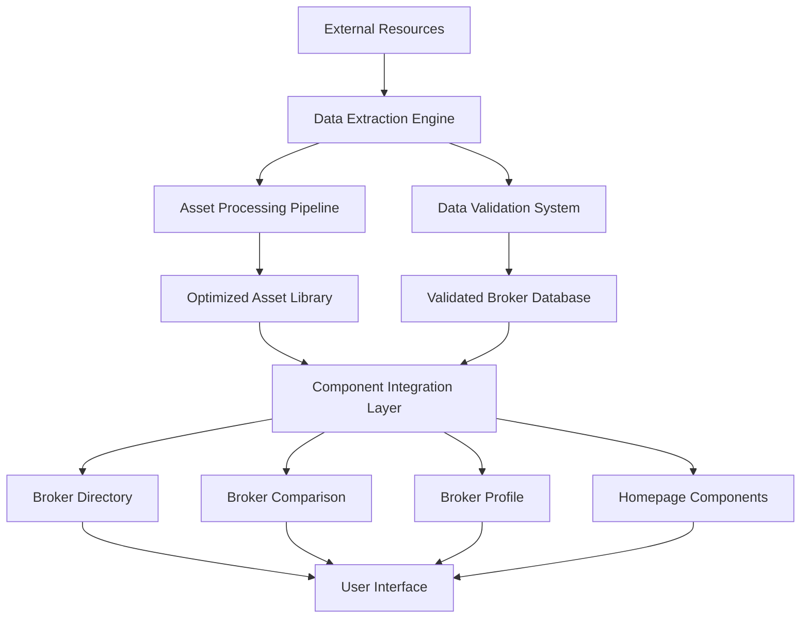

# BrokerAnalysis Platform - Broker Integration Project
## Product Requirements Document (PRD)

## 1. Product Overview

The BrokerAnalysis Platform Broker Integration Project aims to transform the platform from using mock data to real broker information sourced from comprehensive external resources. This integration will process actual broker logos, ratings, features, and regulatory data to provide users with authentic, up-to-date broker comparison capabilities.

The project addresses the critical need for real-world data accuracy in broker comparison, ensuring users can make informed trading decisions based on verified broker information rather than placeholder content.

## 2. Core Features

### 2.1 User Roles

| Role | Registration Method | Core Permissions |
|------|---------------------|------------------|
| Anonymous User | No registration required | Can browse broker listings, view basic comparisons, access public broker profiles |
| Registered User | Email registration | Can save broker comparisons, create watchlists, access detailed analytics, submit reviews |
| Premium User | Subscription upgrade | Can access advanced filtering, real-time data feeds, priority support, export capabilities |
| Administrator | Internal access | Can manage broker data, moderate reviews, update asset libraries, configure system settings |

### 2.2 Feature Module

Our broker integration requirements consist of the following main components:

1. **Asset Management System**: Centralized broker logo and image processing with optimization pipeline
2. **Data Processing Engine**: Real-time broker data extraction and validation from external sources
3. **Component Integration Layer**: Updated UI components using real broker data with fallback mechanisms
4. **Performance Optimization Suite**: Lazy loading, caching, and bundle splitting for enhanced user experience
5. **Validation and Testing Framework**: Comprehensive testing suite ensuring data integrity and component reliability

### 2.3 Page Details

| Page Name | Module Name | Feature description |
|-----------|-------------|---------------------|
| Broker Directory | Asset Display System | Display real broker logos with WebP optimization, fallback mechanisms for missing assets, responsive image loading |
| Broker Directory | Data Integration Engine | Show actual broker ratings, regulatory badges, trading conditions from processed external data sources |
| Broker Directory | Search and Filter System | Filter brokers by real features (regulation, spreads, platforms), search by actual broker names and characteristics |
| Broker Comparison | Side-by-Side Analysis | Compare real broker features, spreads, regulatory status, platform offerings with actual data |
| Broker Comparison | Visual Comparison Tools | Display broker logos consistently, show real rating comparisons, highlight actual feature differences |
| Broker Profile | Comprehensive Details | Present complete broker information including real contact details, website links, regulatory licenses |
| Broker Profile | User Reviews Integration | Display processed user reviews and ratings from external sources with verification status |
| Homepage | Featured Brokers Section | Showcase top-rated brokers with real logos, actual ratings, authentic regulatory information |
| Homepage | Market Data Integration | Display real-time broker information, actual spread data, current promotional offers |
| Asset Management | Logo Processing Pipeline | Extract, resize, optimize broker logos from external sources with multiple format support |
| Asset Management | Image Optimization System | Convert images to WebP format, generate multiple sizes, implement progressive loading |
| Data Validation | Schema Enforcement | Validate broker data against TypeScript interfaces, ensure data integrity with Zod schemas |
| Data Validation | Error Handling System | Graceful degradation for missing data, comprehensive logging, fallback content mechanisms |

## 3. Core Process

### Administrator Flow
Administrators begin by configuring the asset directory structure and processing broker resources from external sources. They extract and optimize broker logos, validate data integrity, and monitor system performance. The process includes setting up automated data pipelines, configuring fallback mechanisms, and maintaining data freshness through regular updates.

### User Flow
Users access the platform to browse authentic broker listings with real logos and verified information. They can filter brokers based on actual features, compare real trading conditions, and view comprehensive broker profiles with genuine contact information. The experience includes seamless image loading, responsive design, and reliable data presentation.

### Data Processing Flow
The system automatically extracts broker information from external resources, processes and validates the data, optimizes assets for web performance, and integrates everything into the platform components. This includes real-time monitoring, error handling, and continuous data synchronization.

## 4. User Interface Design

### 4.1 Design Style

- **Primary Colors**: Professional blue (#1e40af) and clean white (#ffffff) for trust and clarity
- **Secondary Colors**: Accent green (#10b981) for positive indicators, warning amber (#f59e0b) for cautions
- **Button Style**: Rounded corners with subtle shadows, hover effects for interactivity
- **Font**: Inter font family with 16px base size for readability, 14px for secondary text
- **Layout Style**: Card-based design with consistent spacing, top navigation with breadcrumbs
- **Icon Style**: Lucide React icons for consistency, broker-specific favicons for brand recognition

### 4.2 Page Design Overview

| Page Name | Module Name | UI Elements |
|-----------|-------------|-------------|
| Broker Directory | Asset Display | Grid layout with 256x256px broker logos, WebP format with PNG fallbacks, skeleton loading states |
| Broker Directory | Information Cards | Professional cards with real ratings (star icons), regulatory badges, key metrics display |
| Broker Comparison | Comparison Table | Side-by-side layout with real broker logos (64x64px), feature checkmarks, numerical comparisons |
| Broker Comparison | Visual Indicators | Color-coded ratings, progress bars for scores, highlighted differences between brokers |
| Broker Profile | Header Section | Large broker logo (128x128px), company name, regulatory status, contact information |
| Broker Profile | Details Sections | Tabbed interface for features, reviews, contact details with consistent styling |
| Homepage | Featured Section | Carousel with real broker logos, authentic ratings, call-to-action buttons |
| Homepage | Trust Indicators | Real statistics, verified badges, authentic testimonials with proper attribution |

### 4.3 Responsiveness

The platform is designed mobile-first with desktop enhancement, ensuring optimal viewing across all devices. Touch interaction optimization includes larger tap targets, swipe gestures for comparisons, and adaptive image sizing. The responsive design maintains broker logo clarity and information hierarchy across screen sizes while optimizing loading performance for mobile networks.