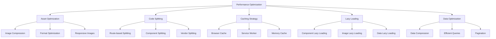

# BrokerAnalysis Platform - Broker Integration Project
## Performance Optimization Strategies

## Overview

This document outlines comprehensive performance optimization strategies for the BrokerAnalysis platform's broker integration project. The strategies focus on lazy loading, caching, bundle splitting, image optimization, and efficient data handling to ensure optimal user experience and platform performance.

## Core Performance Principles

### 1. Performance Metrics Targets

```typescript
// Performance targets for broker integration
const PERFORMANCE_TARGETS = {
  // Core Web Vitals
  LCP: 2.5, // Largest Contentful Paint (seconds)
  FID: 100, // First Input Delay (milliseconds)
  CLS: 0.1, // Cumulative Layout Shift
  
  // Custom Metrics
  brokerCardRender: 100, // Time to render broker card (ms)
  logoLoadTime: 200, // Broker logo load time (ms)
  dataFetchTime: 500, // Broker data fetch time (ms)
  searchResponseTime: 300, // Search response time (ms)
  
  // Bundle Size Targets
  initialBundle: 250, // Initial bundle size (KB)
  brokerDataChunk: 100, // Broker data chunk size (KB)
  imageOptimization: 80 // Image compression ratio (%)
};
```

### 2. Optimization Strategy Framework



## 1. Lazy Loading Implementation

### 1.1 Component Lazy Loading

```typescript
// src/utils/lazyComponents.ts
import { lazy, ComponentType } from 'react';
import { BrokerCardSkeleton } from '@/components/brokeranalysis/BrokerCard';
import { BrokerProfileSkeleton } from '@/components/brokeranalysis/BrokerProfile';
import { BrokerComparisonSkeleton } from '@/components/brokeranalysis/BrokerComparison';

// Lazy load heavy components
export const LazyBrokerProfile = lazy(() => 
  import('@/components/brokeranalysis/BrokerProfile').then(module => ({
    default: module.BrokerProfile
  }))
);

export const LazyBrokerComparison = lazy(() => 
  import('@/components/brokeranalysis/BrokerComparison').then(module => ({
    default: module.BrokerComparison
  }))
);

export const LazyAdvancedSearch = lazy(() => 
  import('@/components/search/AdvancedSearch').then(module => ({
    default: module.AdvancedSearch
  }))
);

// Higher-order component for lazy loading with suspense
export function withLazyLoading<T extends object>(
  LazyComponent: ComponentType<T>,
  FallbackComponent: ComponentType<Partial<T>>
) {
  return function LazyWrapper(props: T) {
    return (
      <Suspense fallback={<FallbackComponent {...props} />}>
        <LazyComponent {...props} />
      </Suspense>
    );
  };
}

// Usage examples
export const BrokerProfileWithSuspense = withLazyLoading(
  LazyBrokerProfile,
  BrokerProfileSkeleton
);

export const BrokerComparisonWithSuspense = withLazyLoading(
  LazyBrokerComparison,
  BrokerComparisonSkeleton
);
```

### 1.2 Image Lazy Loading

```typescript
// src/hooks/useLazyImages.ts
import { useState, useEffect, useRef, useCallback } from 'react';

interface UseLazyImageOptions {
  threshold?: number;
  rootMargin?: string;
  fallbackSrc?: string;
  priority?: boolean;
}

interface UseLazyImageResult {
  imgRef: React.RefObject<HTMLImageElement>;
  isLoaded: boolean;
  isInView: boolean;
  error: boolean;
  retry: () => void;
}

export function useLazyImage(
  src: string,
  options: UseLazyImageOptions = {}
): UseLazyImageResult {
  const {
    threshold = 0.1,
    rootMargin = '50px',
    fallbackSrc,
    priority = false
  } = options;
  
  const imgRef = useRef<HTMLImageElement>(null);
  const [isLoaded, setIsLoaded] = useState(false);
  const [isInView, setIsInView] = useState(priority);
  const [error, setError] = useState(false);
  const [retryCount, setRetryCount] = useState(0);

  const retry = useCallback(() => {
    if (retryCount < 3) {
      setError(false);
      setIsLoaded(false);
      setRetryCount(prev => prev + 1);
    }
  }, [retryCount]);

  // Intersection Observer for lazy loading
  useEffect(() => {
    if (priority) return; // Skip observer for priority images
    
    const observer = new IntersectionObserver(
      ([entry]) => {
        if (entry.isIntersecting) {
          setIsInView(true);
          observer.disconnect();
        }
      },
      { threshold, rootMargin }
    );

    const currentImg = imgRef.current;
    if (currentImg) {
      observer.observe(currentImg);
    }

    return () => {
      if (currentImg) {
        observer.unobserve(currentImg);
      }
    };
  }, [threshold, rootMargin, priority]);

  // Image loading effect
  useEffect(() => {
    if (!isInView) return;

    const img = new Image();
    
    img.onload = () => {
      setIsLoaded(true);
      setError(false);
    };
    
    img.onerror = () => {
      setError(true);
      if (fallbackSrc && retryCount === 0) {
        img.src = fallbackSrc;
      }
    };
    
    img.src = src;
    
    return () => {
      img.onload = null;
      img.onerror = null;
    };
  }, [src, isInView, fallbackSrc, retryCount]);

  return {
    imgRef,
    isLoaded,
    isInView,
    error,
    retry
  };
}

// Optimized Image Component
export interface OptimizedImageProps {
  src: string;
  alt: string;
  width?: number;
  height?: number;
  className?: string;
  priority?: boolean;
  fallbackSrc?: string;
  onLoad?: () => void;
  onError?: () => void;
}

export const OptimizedImage: React.FC<OptimizedImageProps> = ({
  src,
  alt,
  width,
  height,
  className,
  priority = false,
  fallbackSrc,
  onLoad,
  onError
}) => {
  const { imgRef, isLoaded, isInView, error, retry } = useLazyImage(src, {
    priority,
    fallbackSrc
  });

  const handleLoad = useCallback(() => {
    onLoad?.();
  }, [onLoad]);

  const handleError = useCallback(() => {
    onError?.();
  }, [onError]);

  return (
    <div className={cn('relative overflow-hidden', className)}>
      {/* Placeholder while loading */}
      {!isLoaded && (
        <div 
          className="absolute inset-0 bg-gray-200 animate-pulse flex items-center justify-center"
          style={{ width, height }}
        >
          <svg className="w-8 h-8 text-gray-400" fill="none" stroke="currentColor" viewBox="0 0 24 24">
            <path strokeLinecap="round" strokeLinejoin="round" strokeWidth={2} 
                  d="M4 16l4.586-4.586a2 2 0 012.828 0L16 16m-2-2l1.586-1.586a2 2 0 012.828 0L20 14m-6-6h.01M6 20h12a2 2 0 002-2V6a2 2 0 00-2-2H6a2 2 0 00-2 2v12a2 2 0 002 2z" />
          </svg>
        </div>
      )}
      
      {/* Actual image */}
      {isInView && (
        
      )}
      
      {/* Error state */}
      {error && (
        <div className="absolute inset-0 bg-gray-100 flex flex-col items-center justify-center">
          <svg className="w-8 h-8 text-gray-400 mb-2" fill="none" stroke="currentColor" viewBox="0 0 24 24">
            <path strokeLinecap="round" strokeLinejoin="round" strokeWidth={2} 
                  d="M12 8v4m0 4h.01M21 12a9 9 0 11-18 0 9 9 0 0118 0z" />
          </svg>
          <button 
            onClick={retry}
            className="text-xs text-blue-600 hover:text-blue-700"
          >
            Retry
          </button>
        </div>
      )}
    </div>
  );
};
```

### 1.3 Data Lazy Loading

```typescript
// src/hooks/useLazyData.ts
import { useState, useEffect, useCallback } from 'react';

interface UseLazyDataOptions<T> {
  enabled?: boolean;
  threshold?: number;
  rootMargin?: string;
  fetchFn: () => Promise<T>;
  dependencies?: any[];
}

interface UseLazyDataResult<T> {
  data: T | null;
  loading: boolean;
  error: string | null;
  elementRef: React.RefObject<HTMLElement>;
  refetch: () => void;
}

export function useLazyData<T>(
  options: UseLazyDataOptions<T>
): UseLazyDataResult<T> {
  const {
    enabled = true,
    threshold = 0.1,
    rootMargin = '100px',
    fetchFn,
    dependencies = []
  } = options;
  
  const [data, setData] = useState<T | null>(null);
  const [loading, setLoading] = useState(false);
  const [error, setError] = useState<string | null>(null);
  const [isInView, setIsInView] = useState(false);
  const elementRef = useRef<HTMLElement>(null);

  // Intersection Observer
  useEffect(() => {
    if (!enabled) return;
    
    const observer = new IntersectionObserver(
      ([entry]) => {
        if (entry.isIntersecting) {
          setIsInView(true);
          observer.disconnect();
        }
      },
      { threshold, rootMargin }
    );

    const currentElement = elementRef.current;
    if (currentElement) {
      observer.observe(currentElement);
    }

    return () => {
      if (currentElement) {
        observer.unobserve(currentElement);
      }
    };
  }, [enabled, threshold, rootMargin]);

  // Data fetching
  const fetchData = useCallback(async () => {
    if (!enabled || !isInView) return;
    
    try {
      setLoading(true);
      setError(null);
      const result = await fetchFn();
      setData(result);
    } catch (err) {
      setError(err instanceof Error ? err.message : 'Failed to fetch data');
    } finally {
      setLoading(false);
    }
  }, [enabled, isInView, fetchFn]);

  useEffect(() => {
    fetchData();
  }, [fetchData, ...dependencies]);

  return {
    data,
    loading,
    error,
    elementRef,
    refetch: fetchData
  };
}
```

## 2. Caching Strategies

### 2.1 Multi-Level Caching System

```typescript
// src/utils/cacheManager.ts
interface CacheEntry<T> {
  data: T;
  timestamp: number;
  ttl: number;
  hits: number;
}

interface CacheOptions {
  ttl?: number; // Time to live in milliseconds
  maxSize?: number; // Maximum cache size
  strategy?: 'LRU' | 'LFU' | 'FIFO';
}

export class CacheManager<T> {
  private cache = new Map<string, CacheEntry<T>>();
  private accessOrder: string[] = [];
  private readonly maxSize: number;
  private readonly defaultTTL: number;
  private readonly strategy: 'LRU' | 'LFU' | 'FIFO';

  constructor(options: CacheOptions = {}) {
    this.maxSize = options.maxSize || 100;
    this.defaultTTL = options.ttl || 5 * 60 * 1000; // 5 minutes
    this.strategy = options.strategy || 'LRU';
  }

  set(key: string, data: T, ttl?: number): void {
    const now = Date.now();
    const entry: CacheEntry<T> = {
      data,
      timestamp: now,
      ttl: ttl || this.defaultTTL,
      hits: 0
    };

    // Remove expired entries
    this.cleanup();

    // Check if we need to evict
    if (this.cache.size >= this.maxSize && !this.cache.has(key)) {
      this.evict();
    }

    this.cache.set(key, entry);
    this.updateAccessOrder(key);
  }

  get(key: string): T | null {
    const entry = this.cache.get(key);
    
    if (!entry) {
      return null;
    }

    // Check if expired
    if (Date.now() - entry.timestamp > entry.ttl) {
      this.cache.delete(key);
      this.removeFromAccessOrder(key);
      return null;
    }

    // Update access statistics
    entry.hits++;
    this.updateAccessOrder(key);
    
    return entry.data;
  }

  has(key: string): boolean {
    return this.get(key) !== null;
  }

  delete(key: string): boolean {
    const deleted = this.cache.delete(key);
    this.removeFromAccessOrder(key);
    return deleted;
  }

  clear(): void {
    this.cache.clear();
    this.accessOrder = [];
  }

  size(): number {
    this.cleanup();
    return this.cache.size;
  }

  private cleanup(): void {
    const now = Date.now();
    const expiredKeys: string[] = [];

    for (const [key, entry] of this.cache.entries()) {
      if (now - entry.timestamp > entry.ttl) {
        expiredKeys.push(key);
      }
    }

    expiredKeys.forEach(key => {
      this.cache.delete(key);
      this.removeFromAccessOrder(key);
    });
  }

  private evict(): void {
    if (this.cache.size === 0) return;

    let keyToEvict: string;

    switch (this.strategy) {
      case 'LRU':
        keyToEvict = this.accessOrder[0];
        break;
      case 'LFU':
        keyToEvict = this.findLeastFrequentlyUsed();
        break;
      case 'FIFO':
        keyToEvict = this.cache.keys().next().value;
        break;
      default:
        keyToEvict = this.accessOrder[0];
    }

    this.delete(keyToEvict);
  }

  private findLeastFrequentlyUsed(): string {
    let minHits = Infinity;
    let leastUsedKey = '';

    for (const [key, entry] of this.cache.entries()) {
      if (entry.hits < minHits) {
        minHits = entry.hits;
        leastUsedKey = key;
      }
    }

    return leastUsedKey;
  }

  private updateAccessOrder(key: string): void {
    this.removeFromAccessOrder(key);
    this.accessOrder.push(key);
  }

  private removeFromAccessOrder(key: string): void {
    const index = this.accessOrder.indexOf(key);
    if (index > -1) {
      this.accessOrder.splice(index, 1);
    }
  }

  // Cache statistics
  getStats() {
    const totalHits = Array.from(this.cache.values()).reduce(
      (sum, entry) => sum + entry.hits, 0
    );
    
    return {
      size: this.cache.size,
      maxSize: this.maxSize,
      totalHits,
      hitRate: totalHits > 0 ? totalHits / this.cache.size : 0,
      strategy: this.strategy
    };
  }
}

// Specialized caches for different data types
export const brokerCache = new CacheManager<Broker>({
  ttl: 10 * 60 * 1000, // 10 minutes
  maxSize: 200,
  strategy: 'LRU'
});

export const imageCache = new CacheManager<string>({
  ttl: 30 * 60 * 1000, // 30 minutes
  maxSize: 500,
  strategy: 'LFU'
});

export const searchCache = new CacheManager<any>({
  ttl: 5 * 60 * 1000, // 5 minutes
  maxSize: 100,
  strategy: 'LRU'
});
```

### 2.2 Service Worker Caching

```typescript
// public/sw.js
const CACHE_NAME = 'brokeranalysis-v1';
const STATIC_CACHE = 'static-v1';
const DYNAMIC_CACHE = 'dynamic-v1';
const IMAGE_CACHE = 'images-v1';

// Assets to cache immediately
const STATIC_ASSETS = [
  '/',
  '/static/js/bundle.js',
  '/static/css/main.css',
  '/assets/icons/fallback-broker.svg'
];

// Cache strategies
const CACHE_STRATEGIES = {
  // Static assets - Cache First
  static: {
    cacheName: STATIC_CACHE,
    strategy: 'CacheFirst',
    maxAge: 30 * 24 * 60 * 60 * 1000 // 30 days
  },
  
  // API data - Network First with fallback
  api: {
    cacheName: DYNAMIC_CACHE,
    strategy: 'NetworkFirst',
    maxAge: 5 * 60 * 1000 // 5 minutes
  },
  
  // Images - Cache First with network fallback
  images: {
    cacheName: IMAGE_CACHE,
    strategy: 'CacheFirst',
    maxAge: 7 * 24 * 60 * 60 * 1000 // 7 days
  }
};

self.addEventListener('install', event => {
  event.waitUntil(
    caches.open(STATIC_CACHE)
      .then(cache => cache.addAll(STATIC_ASSETS))
      .then(() => self.skipWaiting())
  );
});

self.addEventListener('activate', event => {
  event.waitUntil(
    caches.keys()
      .then(cacheNames => {
        return Promise.all(
          cacheNames
            .filter(cacheName => !Object.values(CACHE_STRATEGIES).some(s => s.cacheName === cacheName))
            .map(cacheName => caches.delete(cacheName))
        );
      })
      .then(() => self.clients.claim())
  );
});

self.addEventListener('fetch', event => {
  const { request } = event;
  const url = new URL(request.url);
  
  // Handle different types of requests
  if (request.destination === 'image') {
    event.respondWith(handleImageRequest(request));
  } else if (url.pathname.startsWith('/api/')) {
    event.respondWith(handleApiRequest(request));
  } else {
    event.respondWith(handleStaticRequest(request));
  }
});

async function handleImageRequest(request) {
  const cache = await caches.open(IMAGE_CACHE);
  const cachedResponse = await cache.match(request);
  
  if (cachedResponse) {
    return cachedResponse;
  }
  
  try {
    const networkResponse = await fetch(request);
    if (networkResponse.ok) {
      cache.put(request, networkResponse.clone());
    }
    return networkResponse;
  } catch (error) {
    // Return fallback image
    return caches.match('/assets/icons/fallback-broker.svg');
  }
}

async function handleApiRequest(request) {
  const cache = await caches.open(DYNAMIC_CACHE);
  
  try {
    const networkResponse = await fetch(request);
    if (networkResponse.ok) {
      cache.put(request, networkResponse.clone());
    }
    return networkResponse;
  } catch (error) {
    const cachedResponse = await cache.match(request);
    return cachedResponse || new Response('Offline', { status: 503 });
  }
}

async function handleStaticRequest(request) {
  const cache = await caches.open(STATIC_CACHE);
  const cachedResponse = await cache.match(request);
  
  if (cachedResponse) {
    return cachedResponse;
  }
  
  try {
    const networkResponse = await fetch(request);
    if (networkResponse.ok) {
      cache.put(request, networkResponse.clone());
    }
    return networkResponse;
  } catch (error) {
    return caches.match('/') || new Response('Offline', { status: 503 });
  }
}
```

## 3. Bundle Splitting and Code Optimization

### 3.1 Vite Configuration for Optimal Bundling

```typescript
// vite.config.ts
import { defineConfig } from 'vite';
import react from '@vitejs/plugin-react';
import { resolve } from 'path';
import { visualizer } from 'rollup-plugin-visualizer';
import { splitVendorChunkPlugin } from 'vite';

export default defineConfig({
  plugins: [
    react(),
    splitVendorChunkPlugin(),
    visualizer({
      filename: 'dist/stats.html',
      open: true,
      gzipSize: true
    })
  ],
  
  resolve: {
    alias: {
      '@': resolve(__dirname, './src')
    }
  },
  
  build: {
    target: 'es2015',
    minify: 'terser',
    sourcemap: false,
    
    rollupOptions: {
      output: {
        manualChunks: {
          // Vendor chunks
          'react-vendor': ['react', 'react-dom'],
          'ui-vendor': ['@radix-ui/react-dialog', '@radix-ui/react-tabs'],
          'utils-vendor': ['date-fns', 'lodash-es'],
          
          // Feature chunks
          'broker-components': [
            './src/components/brokeranalysis/BrokerCard.tsx',
            './src/components/brokeranalysis/BrokerComparison.tsx',
            './src/components/brokeranalysis/BrokerProfile.tsx'
          ],
          
          'search-components': [
            './src/components/search/SearchContainer.tsx',
            './src/components/search/AdvancedSearch.tsx'
          ],
          
          'broker-data': [
            './src/data/brokers/brokerData.ts',
            './src/data/brokers/brokerRatings.ts',
            './src/data/brokers/brokerFeatures.ts'
          ]
        },
        
        chunkFileNames: (chunkInfo) => {
          const facadeModuleId = chunkInfo.facadeModuleId
            ? chunkInfo.facadeModuleId.split('/').pop().replace('.tsx', '').replace('.ts', '')
            : 'chunk';
          return `js/${facadeModuleId}-[hash].js`;
        },
        
        assetFileNames: (assetInfo) => {
          const info = assetInfo.name.split('.');
          const ext = info[info.length - 1];
          
          if (/\.(png|jpe?g|svg|gif|tiff|bmp|ico)$/i.test(assetInfo.name)) {
            return `images/[name]-[hash].${ext}`;
          }
          
          if (/\.(css)$/i.test(assetInfo.name)) {
            return `css/[name]-[hash].${ext}`;
          }
          
          return `assets/[name]-[hash].${ext}`;
        }
      }
    },
    
    terserOptions: {
      compress: {
        drop_console: true,
        drop_debugger: true,
        pure_funcs: ['console.log', 'console.info'],
        passes: 2
      },
      mangle: {
        safari10: true
      },
      format: {
        comments: false
      }
    }
  },
  
  optimizeDeps: {
    include: [
      'react',
      'react-dom',
      'react-router-dom'
    ],
    exclude: [
      '@/data/brokers/brokerData'
    ]
  }
});
```

### 3.2 Dynamic Import Utilities

```typescript
// src/utils/dynamicImports.ts
import { ComponentType } from 'react';

// Dynamic import with retry logic
export async function importWithRetry<T>(
  importFn: () => Promise<{ default: T }>,
  retries = 3,
  delay = 1000
): Promise<T> {
  for (let i = 0; i < retries; i++) {
    try {
      const module = await importFn();
      return module.default;
    } catch (error) {
      if (i === retries - 1) {
        throw error;
      }
      await new Promise(resolve => setTimeout(resolve, delay * (i + 1)));
    }
  }
  throw new Error('Failed to import after retries');
}

// Preload critical chunks
export class ChunkPreloader {
  private static preloadedChunks = new Set<string>();
  
  static async preloadChunk(chunkName: string): Promise<void> {
    if (this.preloadedChunks.has(chunkName)) {
      return;
    }
    
    try {
      switch (chunkName) {
        case 'broker-profile':
          await import('@/components/brokeranalysis/BrokerProfile');
          break;
        case 'broker-comparison':
          await import('@/components/brokeranalysis/BrokerComparison');
          break;
        case 'advanced-search':
          await import('@/components/search/AdvancedSearch');
          break;
        case 'broker-data':
          await import('@/data/brokers/brokerData');
          break;
      }
      
      this.preloadedChunks.add(chunkName);
    } catch (error) {
      console.warn(`Failed to preload chunk: ${chunkName}`, error);
    }
  }
  
  static preloadCriticalChunks(): void {
    // Preload chunks that are likely to be needed soon
    const criticalChunks = ['broker-data', 'broker-profile'];
    
    criticalChunks.forEach(chunk => {
      this.preloadChunk(chunk);
    });
  }
  
  static preloadOnHover(chunkName: string): (event: MouseEvent) => void {
    return (event: MouseEvent) => {
      const target = event.target as HTMLElement;
      if (target.matches('a, button, [role="button"]')) {
        this.preloadChunk(chunkName);
      }
    };
  }
}

// Usage in components
export function useChunkPreloader() {
  useEffect(() => {
    ChunkPreloader.preloadCriticalChunks();
  }, []);
  
  return {
    preloadOnHover: ChunkPreloader.preloadOnHover
  };
}
```

## 4. Performance Monitoring and Analytics

```typescript
// src/utils/performanceMonitor.ts
interface PerformanceMetric {
  name: string;
  value: number;
  timestamp: number;
  url: string;
  userAgent: string;
}

class PerformanceMonitor {
  private metrics: PerformanceMetric[] = [];
  private observer: PerformanceObserver | null = null;
  
  constructor() {
    this.initializeObserver();
    this.trackCoreWebVitals();
  }
  
  private initializeObserver(): void {
    if ('PerformanceObserver' in window) {
      this.observer = new PerformanceObserver((list) => {
        for (const entry of list.getEntries()) {
          this.recordMetric(entry.name, entry.duration || entry.value);
        }
      });
      
      this.observer.observe({ entryTypes: ['measure', 'navigation', 'paint'] });
    }
  }
  
  private trackCoreWebVitals(): void {
    // Track LCP
    if ('PerformanceObserver' in window) {
      const lcpObserver = new PerformanceObserver((list) => {
        const entries = list.getEntries();
        const lastEntry = entries[entries.length - 1];
        this.recordMetric('LCP', lastEntry.startTime);
      });
      lcpObserver.observe({ entryTypes: ['largest-contentful-paint'] });
    }
    
    // Track FID
    if ('PerformanceObserver' in window) {
      const fidObserver = new PerformanceObserver((list) => {
        for (const entry of list.getEntries()) {
          this.recordMetric('FID', entry.processingStart - entry.startTime);
        }
      });
      fidObserver.observe({ entryTypes: ['first-input'] });
    }
    
    // Track CLS
    if ('PerformanceObserver' in window) {
      let clsValue = 0;
      const clsObserver = new PerformanceObserver((list) => {
        for (const entry of list.getEntries()) {
          if (!entry.hadRecentInput) {
            clsValue += entry.value;
          }
        }
        this.recordMetric('CLS', clsValue);
      });
      clsObserver.observe({ entryTypes: ['layout-shift'] });
    }
  }
  
  recordMetric(name: string, value: number): void {
    const metric: PerformanceMetric = {
      name,
      value,
      timestamp: Date.now(),
      url: window.location.href,
      userAgent: navigator.userAgent
    };
    
    this.metrics.push(metric);
    
    // Send to analytics if critical metric
    if (this.isCriticalMetric(name)) {
      this.sendToAnalytics(metric);
    }
  }
  
  private isCriticalMetric(name: string): boolean {
    return ['LCP', 'FID', 'CLS', 'brokerCardRender', 'logoLoadTime'].includes(name);
  }
  
  private async sendToAnalytics(metric: PerformanceMetric): Promise<void> {
    try {
      // Send to your analytics service
      await fetch('/api/analytics/performance', {
        method: 'POST',
        headers: { 'Content-Type': 'application/json' },
        body: JSON.stringify(metric)
      });
    } catch (error) {
      console.warn('Failed to send performance metric:', error);
    }
  }
  
  getMetrics(): PerformanceMetric[] {
    return [...this.metrics];
  }
  
  getMetricsByName(name: string): PerformanceMetric[] {
    return this.metrics.filter(m => m.name === name);
  }
  
  getAverageMetric(name: string): number {
    const metrics = this.getMetricsByName(name);
    if (metrics.length === 0) return 0;
    
    const sum = metrics.reduce((acc, m) => acc + m.value, 0);
    return sum / metrics.length;
  }
  
  generateReport(): object {
    const report = {
      timestamp: Date.now(),
      url: window.location.href,
      metrics: {
        LCP: this.getAverageMetric('LCP'),
        FID: this.getAverageMetric('FID'),
        CLS: this.getAverageMetric('CLS'),
        brokerCardRender: this.getAverageMetric('brokerCardRender'),
        logoLoadTime: this.getAverageMetric('logoLoadTime')
      },
      performance: {
        navigation: performance.getEntriesByType('navigation')[0],
        paint: performance.getEntriesByType('paint')
      }
    };
    
    return report;
  }
}

export const performanceMonitor = new PerformanceMonitor();

// React hook for component performance tracking
export function usePerformanceTracking(componentName: string) {
  const startTime = useRef<number>(0);
  
  useEffect(() => {
    startTime.current = performance.now();
    
    return () => {
      const endTime = performance.now();
      const renderTime = endTime - startTime.current;
      performanceMonitor.recordMetric(`${componentName}Render`, renderTime);
    };
  }, [componentName]);
  
  const trackAction = useCallback((actionName: string) => {
    const actionStartTime = performance.now();
    
    return () => {
      const actionEndTime = performance.now();
      const actionDuration = actionEndTime - actionStartTime;
      performanceMonitor.recordMetric(`${componentName}${actionName}`, actionDuration);
    };
  }, [componentName]);
  
  return { trackAction };
}
```

This comprehensive performance optimization strategy ensures that the BrokerAnalysis platform delivers optimal user experience through efficient resource loading, intelligent caching, and continuous performance monitoring.