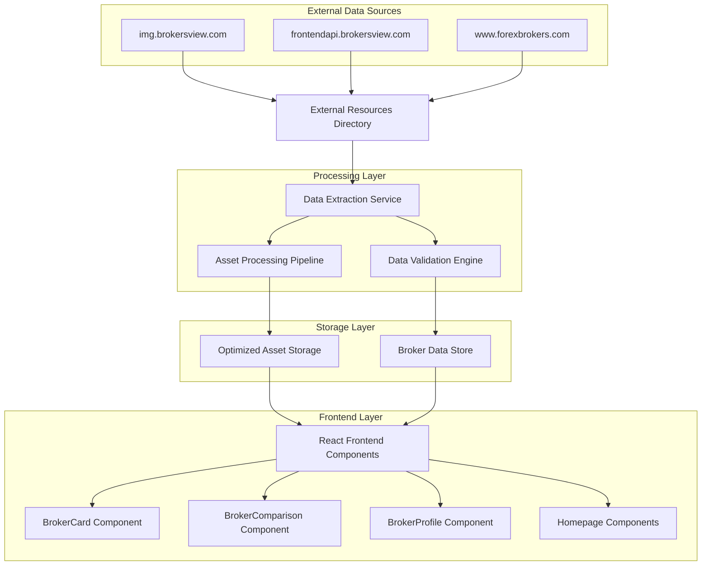
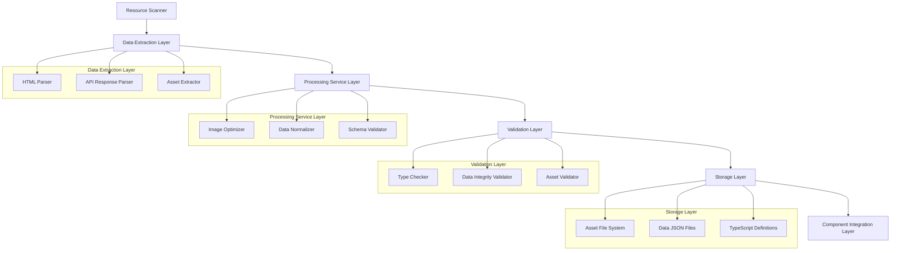
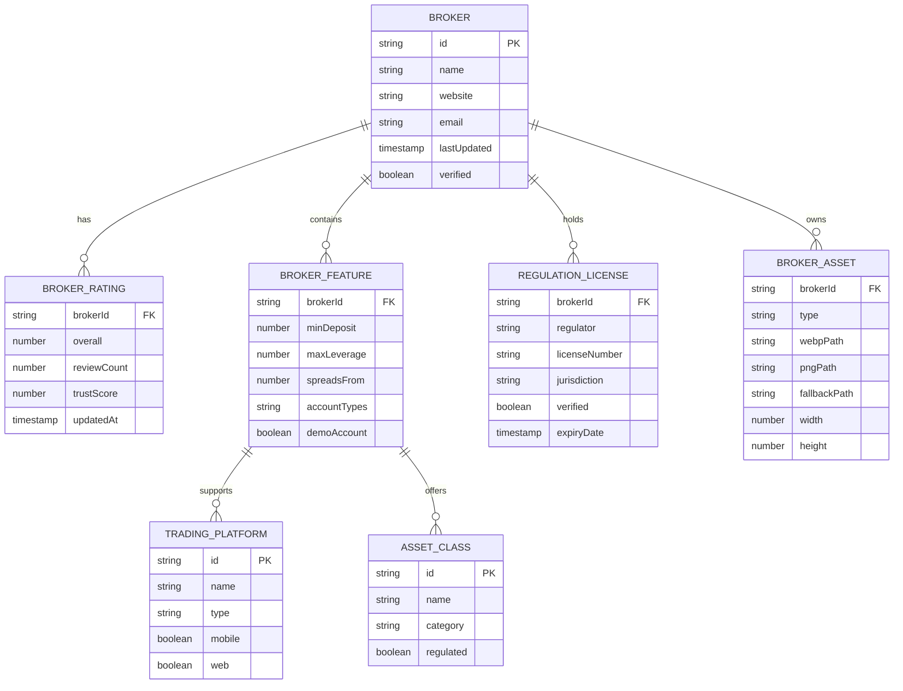

# BrokerAnalysis Platform - Broker Integration Project
## Technical Architecture Document

## 1. Architecture Design



## 2. Technology Description

- **Frontend**: React@18 + TypeScript@5 + Vite@5 + TailwindCSS@3
- **Data Processing**: Node.js scripts for extraction and validation
- **Asset Optimization**: Sharp for image processing, WebP conversion
- **Validation**: Zod@3 for runtime type checking and schema validation
- **State Management**: React Context + Custom hooks for broker data
- **Performance**: React.lazy for code splitting, Intersection Observer for lazy loading

## 3. Route Definitions

| Route | Purpose |
|-------|---------|
| / | Homepage with featured brokers using real data |
| /brokers | Broker directory with comprehensive filtering and real broker listings |
| /brokers/:id | Individual broker profile with complete real information |
| /compare | Broker comparison tool with side-by-side real data analysis |
| /compare/:ids | Direct comparison of specific brokers with real features |

## 4. API Definitions

### 4.1 Core Data Interfaces

**Broker Data Structure**
```typescript
interface Broker {
  id: string;
  name: string;
  logo: {
    square: string;     // 256x256px WebP with PNG fallback
    horizontal: string; // Horizontal logo variant
    favicon: string;    // 32x32px favicon
  };
  rating: {
    overall: number;    // 1-5 scale
    reviewCount: number;
    trustScore: number; // 1-100 scale
  };
  regulation: {
    licenses: RegulationLicense[];
    jurisdictions: string[];
    verified: boolean;
  };
  features: {
    minDeposit: number;
    maxLeverage: number;
    spreadsFrom: number;
    platforms: TradingPlatform[];
    assetClasses: AssetClass[];
  };
  contact: {
    website: string;
    email?: string;
    phone?: string;
    address?: Address;
  };
  lastUpdated: string;
}
```

**Asset Management Interface**
```typescript
interface BrokerAsset {
  brokerId: string;
  type: 'logo' | 'image' | 'favicon';
  variants: {
    webp: string;
    png: string;
    sizes: number[]; // [64, 128, 256]
  };
  fallback: string;
  optimized: boolean;
}
```

### 4.2 Data Processing APIs

**Asset Processing Service**
```typescript
class AssetProcessor {
  async extractLogos(sourceDir: string): Promise<BrokerAsset[]>
  async optimizeImage(input: string, sizes: number[]): Promise<OptimizedAsset>
  async generateWebP(source: string): Promise<string>
  async createFallback(brokerId: string): Promise<string>
}
```

**Data Extraction Service**
```typescript
class BrokerDataExtractor {
  async extractFromBrokersView(apiDir: string): Promise<Broker[]>
  async parseForexBrokersData(htmlDir: string): Promise<Broker[]>
  async validateBrokerData(data: unknown): Promise<Broker>
  async mergeBrokerSources(sources: Broker[][]): Promise<Broker[]>
}
```

## 5. Server Architecture Diagram



## 6. Data Model

### 6.1 Data Model Definition



### 6.2 Data Definition Language

**Broker Data Schema (TypeScript)**
```typescript
// src/types/broker.ts
export const BrokerSchema = z.object({
  id: z.string().min(1),
  name: z.string().min(1),
  logo: z.object({
    square: z.string().url(),
    horizontal: z.string().url(),
    favicon: z.string().url()
  }),
  rating: z.object({
    overall: z.number().min(1).max(5),
    reviewCount: z.number().min(0),
    trustScore: z.number().min(1).max(100)
  }),
  regulation: z.object({
    licenses: z.array(RegulationLicenseSchema),
    jurisdictions: z.array(z.string()),
    verified: z.boolean()
  }),
  features: z.object({
    minDeposit: z.number().min(0),
    maxLeverage: z.number().min(1),
    spreadsFrom: z.number().min(0),
    platforms: z.array(z.enum(['MT4', 'MT5', 'cTrader', 'Proprietary'])),
    assetClasses: z.array(z.enum(['Forex', 'Stocks', 'Crypto', 'CFD', 'Commodities']))
  }),
  contact: z.object({
    website: z.string().url(),
    email: z.string().email().optional(),
    phone: z.string().optional(),
    address: AddressSchema.optional()
  }),
  lastUpdated: z.string().datetime()
});
```

**Asset Directory Structure**
```
public/assets/brokers/
├── logos/
│   ├── square/
│   │   ├── webp/
│   │   │   ├── 64x64/
│   │   │   ├── 128x128/
│   │   │   └── 256x256/
│   │   └── png/
│   │       ├── 64x64/
│   │       ├── 128x128/
│   │       └── 256x256/
│   ├── horizontal/
│   │   ├── webp/
│   │   └── png/
│   └── favicons/
│       ├── webp/
│       └── png/
├── images/
│   ├── screenshots/
│   └── promotional/
└── fallbacks/
    ├── broker-placeholder.webp
    └── broker-placeholder.png
```

**Data File Structure**
```
src/data/brokers/
├── brokerData.ts          // Main broker information
├── brokerRatings.ts       // Ratings and reviews
├── brokerFeatures.ts      // Trading features and conditions
├── regulationData.ts      // Regulatory information
├── assetMappings.ts       // Asset path mappings
└── index.ts              // Consolidated exports
```

**Processing Scripts**
```
scripts/
├── extractBrokerData.ts   // Extract data from resources
├── processAssets.ts       // Optimize and convert images
├── validateData.ts        // Validate extracted data
├── generateTypes.ts       // Generate TypeScript types
└── buildAssetIndex.ts     // Create asset mapping files
```