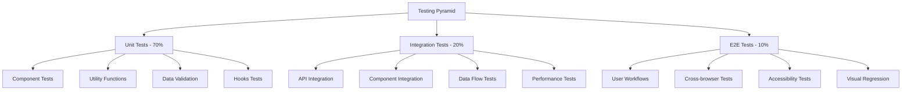

# BrokerAnalysis Platform - Broker Integration Project
## Testing and Validation Procedures

## Overview

This document outlines comprehensive testing and validation procedures for the BrokerAnalysis platform's broker integration project. The procedures cover unit testing, integration testing, performance testing, data validation, accessibility testing, and end-to-end testing to ensure robust and reliable broker data integration.

## Testing Strategy Framework

### 1. Testing Pyramid



### 2. Testing Environments

```typescript
// Test environment configuration
const TEST_ENVIRONMENTS = {
  unit: {
    framework: 'Vitest',
    environment: 'jsdom',
    coverage: 'c8',
    threshold: 80
  },
  integration: {
    framework: 'Vitest + Testing Library',
    environment: 'jsdom',
    mockStrategy: 'MSW',
    dataFixtures: true
  },
  e2e: {
    framework: 'Playwright',
    browsers: ['chromium', 'firefox', 'webkit'],
    viewports: ['desktop', 'tablet', 'mobile'],
    accessibility: 'axe-core'
  },
  performance: {
    framework: 'Lighthouse CI',
    metrics: ['LCP', 'FID', 'CLS', 'TTI'],
    budgets: {
      performance: 90,
      accessibility: 95,
      bestPractices: 90,
      seo: 95
    }
  }
};
```

## 1. Unit Testing

### 1.1 Component Testing

```typescript
// src/components/brokeranalysis/__tests__/BrokerCard.test.tsx
import { describe, it, expect, vi, beforeEach } from 'vitest';
import { render, screen, fireEvent, waitFor } from '@testing-library/react';
import { BrokerCard } from '../BrokerCard';
import { mockBroker } from '@/test/fixtures/brokerFixtures';
import { imagePreloader } from '@/utils/imagePreloader';

// Mock dependencies
vi.mock('@/utils/imagePreloader', () => ({
  imagePreloader: {
    preloadBrokerLogos: vi.fn().mockResolvedValue(undefined)
  }
}));

vi.mock('@/components/common/BrokerLogo', () => ({
  BrokerLogo: ({ broker, className }: any) => (
    <div className={className} data-testid="broker-logo">
      {broker.name} Logo
    </div>
  )
}));

describe('BrokerCard', () => {
  const defaultProps = {
    broker: mockBroker,
    variant: 'standard' as const,
    showComparison: false
  };

  beforeEach(() => {
    vi.clearAllMocks();
  });

  describe('Rendering', () => {
    it('should render broker information correctly', () => {
      render(<BrokerCard {...defaultProps} />);
      
      expect(screen.getByText(mockBroker.name)).toBeInTheDocument();
      expect(screen.getByTestId('broker-logo')).toBeInTheDocument();
      expect(screen.getByText(`${mockBroker.rating.overall.toFixed(1)}`)).toBeInTheDocument();
      expect(screen.getByText('View Profile →')).toBeInTheDocument();
    });

    it('should render compact variant correctly', () => {
      render(<BrokerCard {...defaultProps} variant="compact" />);
      
      expect(screen.getByText(mockBroker.name)).toBeInTheDocument();
      // Trading conditions should not be visible in compact mode
      expect(screen.queryByText('Min Deposit')).not.toBeInTheDocument();
    });

    it('should show comparison button when showComparison is true', () => {
      const onCompare = vi.fn();
      render(
        <BrokerCard 
          {...defaultProps} 
          showComparison={true} 
          onCompare={onCompare}
        />
      );
      
      const compareButton = screen.getByTitle('Add to comparison');
      expect(compareButton).toBeInTheDocument();
      
      fireEvent.click(compareButton);
      expect(onCompare).toHaveBeenCalledWith(mockBroker);
    });
  });

  describe('Interactions', () => {
    it('should navigate to broker profile when clicked', () => {
      // Mock window.location
      const originalLocation = window.location;
      delete (window as any).location;
      window.location = { ...originalLocation, href: '' };
      
      render(<BrokerCard {...defaultProps} />);
      
      const card = screen.getByRole('generic').closest('[class*="cursor-pointer"]');
      fireEvent.click(card!);
      
      expect(window.location.href).toBe(`/brokers/${mockBroker.id}`);
      
      // Restore window.location
      window.location = originalLocation;
    });

    it('should prevent event propagation when compare button is clicked', () => {
      const onCompare = vi.fn();
      const cardClickSpy = vi.fn();
      
      render(
        <div onClick={cardClickSpy}>
          <BrokerCard 
            {...defaultProps} 
            showComparison={true} 
            onCompare={onCompare}
          />
        </div>
      );
      
      const compareButton = screen.getByTitle('Add to comparison');
      fireEvent.click(compareButton);
      
      expect(onCompare).toHaveBeenCalledWith(mockBroker);
      expect(cardClickSpy).not.toHaveBeenCalled();
    });
  });

  describe('Accessibility', () => {
    it('should have proper ARIA attributes', () => {
      render(<BrokerCard {...defaultProps} />);
      
      const viewProfileButton = screen.getByText('View Profile →');
      expect(viewProfileButton).toHaveAttribute('role', 'button');
      
      const compareButton = screen.queryByTitle('Add to comparison');
      if (compareButton) {
        expect(compareButton).toHaveAttribute('title', 'Add to comparison');
      }
    });

    it('should support keyboard navigation', () => {
      render(<BrokerCard {...defaultProps} showComparison={true} />);
      
      const compareButton = screen.getByTitle('Add to comparison');
      compareButton.focus();
      
      expect(document.activeElement).toBe(compareButton);
    });
  });

  describe('Error Handling', () => {
    it('should handle missing broker data gracefully', () => {
      const incompleteBroker = {
        ...mockBroker,
        displayName: undefined,
        rating: { ...mockBroker.rating, overall: 0 }
      };
      
      render(<BrokerCard {...defaultProps} broker={incompleteBroker} />);
      
      expect(screen.getByText(incompleteBroker.name)).toBeInTheDocument();
    });
  });
});
```

### 1.2 Data Validation Testing

```typescript
// src/utils/__tests__/brokerValidation.test.ts
import { describe, it, expect } from 'vitest';
import { validateBroker, validateBrokerArray } from '../brokerValidation';
import { mockBroker, invalidBrokerData } from '@/test/fixtures/brokerFixtures';

describe('Broker Validation', () => {
  describe('validateBroker', () => {
    it('should validate correct broker data', () => {
      const result = validateBroker(mockBroker);
      
      expect(result.success).toBe(true);
      expect(result.data).toEqual(mockBroker);
      expect(result.errors).toBeUndefined();
    });

    it('should reject broker with missing required fields', () => {
      const invalidBroker = {
        ...mockBroker,
        id: undefined,
        name: ''
      };
      
      const result = validateBroker(invalidBroker);
      
      expect(result.success).toBe(false);
      expect(result.errors).toContain('ID is required');
      expect(result.errors).toContain('Name cannot be empty');
    });

    it('should validate rating constraints', () => {
      const invalidRating = {
        ...mockBroker,
        rating: {
          ...mockBroker.rating,
          overall: 6, // Invalid: should be 0-5
          trustScore: -10 // Invalid: should be 0-100
        }
      };
      
      const result = validateBroker(invalidRating);
      
      expect(result.success).toBe(false);
      expect(result.errors).toContain('Rating must be between 0 and 5');
      expect(result.errors).toContain('Trust score must be between 0 and 100');
    });

    it('should validate regulation data', () => {
      const invalidRegulation = {
        ...mockBroker,
        regulation: {
          ...mockBroker.regulation,
          licenses: [
            {
              regulator: '', // Invalid: empty regulator
              licenseNumber: 'ABC123',
              status: 'invalid_status' // Invalid: not in enum
            }
          ]
        }
      };
      
      const result = validateBroker(invalidRegulation);
      
      expect(result.success).toBe(false);
      expect(result.errors).toContain('Regulator name is required');
      expect(result.errors).toContain('Invalid license status');
    });

    it('should validate trading features', () => {
      const invalidFeatures = {
        ...mockBroker,
        features: {
          ...mockBroker.features,
          trading: {
            ...mockBroker.features.trading,
            minDeposit: -100, // Invalid: negative deposit
            maxLeverage: 0, // Invalid: zero leverage
            spreadsFrom: -1 // Invalid: negative spread
          }
        }
      };
      
      const result = validateBroker(invalidFeatures);
      
      expect(result.success).toBe(false);
      expect(result.errors).toContain('Minimum deposit cannot be negative');
      expect(result.errors).toContain('Maximum leverage must be positive');
      expect(result.errors).toContain('Spreads cannot be negative');
    });
  });

  describe('validateBrokerArray', () => {
    it('should validate array of brokers', () => {
      const brokers = [mockBroker, { ...mockBroker, id: 'broker-2' }];
      const result = validateBrokerArray(brokers);
      
      expect(result.success).toBe(true);
      expect(result.data).toHaveLength(2);
      expect(result.errors).toBeUndefined();
    });

    it('should filter out invalid brokers and report errors', () => {
      const brokers = [
        mockBroker,
        { ...mockBroker, id: '', name: '' }, // Invalid
        { ...mockBroker, id: 'broker-3' }
      ];
      
      const result = validateBrokerArray(brokers);
      
      expect(result.success).toBe(true);
      expect(result.data).toHaveLength(2); // Only valid brokers
      expect(result.warnings).toContain('Filtered out 1 invalid broker(s)');
    });

    it('should detect duplicate broker IDs', () => {
      const brokers = [
        mockBroker,
        { ...mockBroker } // Duplicate ID
      ];
      
      const result = validateBrokerArray(brokers);
      
      expect(result.success).toBe(false);
      expect(result.errors).toContain(`Duplicate broker ID: ${mockBroker.id}`);
    });
  });
});
```

### 1.3 Utility Function Testing

```typescript
// src/utils/__tests__/imagePreloader.test.ts
import { describe, it, expect, vi, beforeEach, afterEach } from 'vitest';
import { imagePreloader } from '../imagePreloader';
import { mockBroker } from '@/test/fixtures/brokerFixtures';

// Mock Image constructor
class MockImage {
  onload: (() => void) | null = null;
  onerror: (() => void) | null = null;
  src = '';
  
  constructor() {
    setTimeout(() => {
      if (this.src.includes('error')) {
        this.onerror?.();
      } else {
        this.onload?.();
      }
    }, 10);
  }
}

global.Image = MockImage as any;

describe('Image Preloader', () => {
  beforeEach(() => {
    vi.clearAllMocks();
    imagePreloader.clearCache();
  });

  describe('preloadBrokerLogos', () => {
    it('should preload broker logos successfully', async () => {
      const brokers = [mockBroker];
      
      await expect(
        imagePreloader.preloadBrokerLogos(brokers, 'square', 'medium')
      ).resolves.toBeUndefined();
      
      expect(imagePreloader.getCacheSize()).toBe(1);
    });

    it('should handle preload errors gracefully', async () => {
      const brokerWithErrorLogo = {
        ...mockBroker,
        logos: {
          ...mockBroker.logos,
          square: {
            ...mockBroker.logos.square,
            medium: '/error-logo.png'
          }
        }
      };
      
      await expect(
        imagePreloader.preloadBrokerLogos([brokerWithErrorLogo], 'square', 'medium')
      ).resolves.toBeUndefined();
      
      // Should not cache failed images
      expect(imagePreloader.getCacheSize()).toBe(0);
    });

    it('should not preload already cached images', async () => {
      const brokers = [mockBroker];
      
      // First preload
      await imagePreloader.preloadBrokerLogos(brokers, 'square', 'medium');
      expect(imagePreloader.getCacheSize()).toBe(1);
      
      // Second preload should use cache
      await imagePreloader.preloadBrokerLogos(brokers, 'square', 'medium');
      expect(imagePreloader.getCacheSize()).toBe(1);
    });
  });

  describe('preloadImage', () => {
    it('should preload single image', async () => {
      const imageUrl = '/test-image.png';
      
      await expect(
        imagePreloader.preloadImage(imageUrl)
      ).resolves.toBe(imageUrl);
    });

    it('should reject on image load error', async () => {
      const errorImageUrl = '/error-image.png';
      
      await expect(
        imagePreloader.preloadImage(errorImageUrl)
      ).rejects.toThrow('Failed to load image');
    });
  });

  describe('cache management', () => {
    it('should respect cache size limits', async () => {
      const maxCacheSize = 5;
      imagePreloader.setMaxCacheSize(maxCacheSize);
      
      // Preload more images than cache size
      const promises = Array.from({ length: 10 }, (_, i) => 
        imagePreloader.preloadImage(`/image-${i}.png`)
      );
      
      await Promise.allSettled(promises);
      
      expect(imagePreloader.getCacheSize()).toBeLessThanOrEqual(maxCacheSize);
    });

    it('should clear cache correctly', async () => {
      await imagePreloader.preloadImage('/test-image.png');
      expect(imagePreloader.getCacheSize()).toBe(1);
      
      imagePreloader.clearCache();
      expect(imagePreloader.getCacheSize()).toBe(0);
    });
  });
});
```

## 2. Integration Testing

### 2.1 Component Integration Tests

```typescript
// src/components/brokeranalysis/__tests__/BrokerComparison.integration.test.tsx
import { describe, it, expect, vi, beforeEach } from 'vitest';
import { render, screen, fireEvent, waitFor } from '@testing-library/react';
import { BrokerComparison } from '../BrokerComparison';
import { BrokerService } from '@/services/brokerService';
import { mockBrokers } from '@/test/fixtures/brokerFixtures';

// Mock BrokerService
vi.mock('@/services/brokerService', () => ({
  BrokerService: {
    getBrokers: vi.fn(),
    getBrokerById: vi.fn()
  }
}));

describe('BrokerComparison Integration', () => {
  beforeEach(() => {
    vi.clearAllMocks();
    (BrokerService.getBrokers as any).mockResolvedValue(mockBrokers);
  });

  it('should load and display broker comparison data', async () => {
    render(<BrokerComparison brokers={mockBrokers.slice(0, 2)} />);
    
    // Check that broker headers are rendered
    await waitFor(() => {
      expect(screen.getByText(mockBrokers[0].name)).toBeInTheDocument();
      expect(screen.getByText(mockBrokers[1].name)).toBeInTheDocument();
    });
    
    // Check that comparison data is displayed
    expect(screen.getByText('Trust Score')).toBeInTheDocument();
    expect(screen.getByText('Min Deposit')).toBeInTheDocument();
    expect(screen.getByText('Max Leverage')).toBeInTheDocument();
  });

  it('should handle broker removal', async () => {
    const onRemoveBroker = vi.fn();
    
    render(
      <BrokerComparison 
        brokers={mockBrokers.slice(0, 2)} 
        onRemoveBroker={onRemoveBroker}
      />
    );
    
    const removeButtons = await screen.findAllByText('Remove');
    fireEvent.click(removeButtons[0]);
    
    expect(onRemoveBroker).toHaveBeenCalledWith(mockBrokers[0].id);
  });

  it('should filter comparison categories', async () => {
    render(<BrokerComparison brokers={mockBrokers.slice(0, 2)} />);
    
    // Initially all categories should be selected
    expect(screen.getByText('Trading Conditions')).toBeInTheDocument();
    expect(screen.getByText('Regulation')).toBeInTheDocument();
    
    // Deselect trading category
    const tradingButton = screen.getByText('Trading');
    fireEvent.click(tradingButton);
    
    // Trading conditions should be hidden
    await waitFor(() => {
      expect(screen.queryByText('Min Deposit')).not.toBeInTheDocument();
    });
  });

  it('should show empty state when no brokers', () => {
    render(<BrokerComparison brokers={[]} />);
    
    expect(screen.getByText('No Brokers Selected')).toBeInTheDocument();
    expect(screen.getByText('Add brokers to compare their features side by side')).toBeInTheDocument();
  });
});
```

### 2.2 Data Flow Integration Tests

```typescript
// src/hooks/__tests__/useBrokerData.integration.test.ts
import { describe, it, expect, vi, beforeEach } from 'vitest';
import { renderHook, waitFor } from '@testing-library/react';
import { useBrokerData } from '../useBrokerData';
import { BrokerService } from '@/services/brokerService';
import { mockBrokers } from '@/test/fixtures/brokerFixtures';

vi.mock('@/services/brokerService');

describe('useBrokerData Integration', () => {
  beforeEach(() => {
    vi.clearAllMocks();
  });

  it('should fetch and return broker data', async () => {
    (BrokerService.getBrokers as any).mockResolvedValue(mockBrokers);
    
    const { result } = renderHook(() => useBrokerData());
    
    expect(result.current.loading).toBe(true);
    expect(result.current.brokers).toEqual([]);
    
    await waitFor(() => {
      expect(result.current.loading).toBe(false);
    });
    
    expect(result.current.brokers).toEqual(mockBrokers);
    expect(result.current.error).toBeNull();
  });

  it('should handle fetch errors', async () => {
    const errorMessage = 'Failed to fetch brokers';
    (BrokerService.getBrokers as any).mockRejectedValue(new Error(errorMessage));
    
    const { result } = renderHook(() => useBrokerData());
    
    await waitFor(() => {
      expect(result.current.loading).toBe(false);
    });
    
    expect(result.current.brokers).toEqual([]);
    expect(result.current.error).toBe(errorMessage);
  });

  it('should refetch data when options change', async () => {
    (BrokerService.getBrokers as any).mockResolvedValue(mockBrokers);
    
    const { result, rerender } = renderHook(
      ({ featured }) => useBrokerData({ featured }),
      { initialProps: { featured: false } }
    );
    
    await waitFor(() => {
      expect(result.current.loading).toBe(false);
    });
    
    expect(BrokerService.getBrokers).toHaveBeenCalledWith({ featured: false });
    
    // Change options
    rerender({ featured: true });
    
    await waitFor(() => {
      expect(BrokerService.getBrokers).toHaveBeenCalledWith({ featured: true });
    });
  });

  it('should support manual refetch', async () => {
    (BrokerService.getBrokers as any).mockResolvedValue(mockBrokers);
    
    const { result } = renderHook(() => useBrokerData());
    
    await waitFor(() => {
      expect(result.current.loading).toBe(false);
    });
    
    expect(BrokerService.getBrokers).toHaveBeenCalledTimes(1);
    
    // Manual refetch
    result.current.refetch();
    
    await waitFor(() => {
      expect(BrokerService.getBrokers).toHaveBeenCalledTimes(2);
    });
  });
});
```

## 3. End-to-End Testing

### 3.1 Playwright E2E Tests

```typescript
// tests/e2e/broker-integration.spec.ts
import { test, expect } from '@playwright/test';

test.describe('Broker Integration E2E', () => {
  test.beforeEach(async ({ page }) => {
    await page.goto('/');
  });

  test('should display broker cards on homepage', async ({ page }) => {
    // Wait for broker cards to load
    await page.waitForSelector('[data-testid="broker-card"]');
    
    // Check that broker cards are visible
    const brokerCards = page.locator('[data-testid="broker-card"]');
    await expect(brokerCards).toHaveCount(6); // Assuming 6 featured brokers
    
    // Check that each card has required elements
    const firstCard = brokerCards.first();
    await expect(firstCard.locator('[data-testid="broker-logo"]')).toBeVisible();
    await expect(firstCard.locator('[data-testid="broker-name"]')).toBeVisible();
    await expect(firstCard.locator('[data-testid="broker-rating"]')).toBeVisible();
  });

  test('should navigate to broker profile', async ({ page }) => {
    // Click on first broker card
    await page.click('[data-testid="broker-card"]:first-child');
    
    // Should navigate to broker profile page
    await expect(page).toHaveURL(/\/brokers\/[\w-]+/);
    
    // Check that profile page loads correctly
    await expect(page.locator('h1')).toBeVisible();
    await expect(page.locator('[data-testid="broker-logo"]')).toBeVisible();
    await expect(page.locator('[data-testid="rating-display"]')).toBeVisible();
  });

  test('should add brokers to comparison', async ({ page }) => {
    // Navigate to brokers page
    await page.goto('/brokers');
    
    // Add first broker to comparison
    await page.click('[data-testid="add-to-comparison"]:first-child');
    
    // Check that comparison indicator appears
    await expect(page.locator('[data-testid="comparison-count"]')).toHaveText('1');
    
    // Add second broker
    await page.click('[data-testid="add-to-comparison"]:nth-child(2)');
    await expect(page.locator('[data-testid="comparison-count"]')).toHaveText('2');
    
    // Navigate to comparison page
    await page.click('[data-testid="view-comparison"]');
    await expect(page).toHaveURL('/compare');
    
    // Check that comparison table is displayed
    await expect(page.locator('[data-testid="comparison-table"]')).toBeVisible();
    await expect(page.locator('[data-testid="broker-header"]')).toHaveCount(2);
  });

  test('should search and filter brokers', async ({ page }) => {
    await page.goto('/brokers');
    
    // Use search functionality
    await page.fill('[data-testid="broker-search"]', 'FXCM');
    await page.press('[data-testid="broker-search"]', 'Enter');
    
    // Check that search results are filtered
    await page.waitForSelector('[data-testid="broker-card"]');
    const searchResults = page.locator('[data-testid="broker-card"]');
    await expect(searchResults).toHaveCount(1);
    
    // Clear search
    await page.fill('[data-testid="broker-search"]', '');
    await page.press('[data-testid="broker-search"]', 'Enter');
    
    // Apply regulation filter
    await page.click('[data-testid="filter-regulation"]');
    await page.check('[data-testid="regulation-fca"]');
    await page.click('[data-testid="apply-filters"]');
    
    // Check that results are filtered by regulation
    await page.waitForSelector('[data-testid="broker-card"]');
    const filteredResults = page.locator('[data-testid="broker-card"]');
    const count = await filteredResults.count();
    expect(count).toBeGreaterThan(0);
  });

  test('should handle image loading and fallbacks', async ({ page }) => {
    // Block image requests to test fallbacks
    await page.route('**/*.{png,jpg,jpeg,webp}', route => route.abort());
    
    await page.goto('/');
    
    // Check that fallback images are displayed
    await page.waitForSelector('[data-testid="broker-card"]');
    const logoElements = page.locator('[data-testid="broker-logo"] img');
    
    // Verify that fallback mechanism works
    for (let i = 0; i < await logoElements.count(); i++) {
      const logo = logoElements.nth(i);
      await expect(logo).toHaveAttribute('src', /fallback/);
    }
  });

  test('should be responsive across different viewports', async ({ page }) => {
    const viewports = [
      { width: 1920, height: 1080 }, // Desktop
      { width: 768, height: 1024 },  // Tablet
      { width: 375, height: 667 }    // Mobile
    ];
    
    for (const viewport of viewports) {
      await page.setViewportSize(viewport);
      await page.goto('/');
      
      // Check that broker cards are visible and properly laid out
      await page.waitForSelector('[data-testid="broker-card"]');
      const brokerCards = page.locator('[data-testid="broker-card"]');
      
      // Verify that cards are visible
      await expect(brokerCards.first()).toBeVisible();
      
      // Check responsive navigation
      if (viewport.width < 768) {
        // Mobile: hamburger menu should be visible
        await expect(page.locator('[data-testid="mobile-menu-button"]')).toBeVisible();
      } else {
        // Desktop/Tablet: full navigation should be visible
        await expect(page.locator('[data-testid="desktop-navigation"]')).toBeVisible();
      }
    }
  });
});
```

### 3.2 Performance Testing

```typescript
// tests/performance/lighthouse.config.js
module.exports = {
  ci: {
    collect: {
      url: [
        'http://localhost:3000/',
        'http://localhost:3000/brokers',
        'http://localhost:3000/brokers/fxcm',
        'http://localhost:3000/compare'
      ],
      numberOfRuns: 3,
      settings: {
        chromeFlags: '--no-sandbox --disable-dev-shm-usage'
      }
    },
    assert: {
      assertions: {
        'categories:performance': ['error', { minScore: 0.9 }],
        'categories:accessibility': ['error', { minScore: 0.95 }],
        'categories:best-practices': ['error', { minScore: 0.9 }],
        'categories:seo': ['error', { minScore: 0.95 }],
        'first-contentful-paint': ['error', { maxNumericValue: 2000 }],
        'largest-contentful-paint': ['error', { maxNumericValue: 2500 }],
        'cumulative-layout-shift': ['error', { maxNumericValue: 0.1 }]
      }
    },
    upload: {
      target: 'temporary-public-storage'
    }
  }
};

// tests/performance/performance.spec.ts
import { test, expect } from '@playwright/test';

test.describe('Performance Tests', () => {
  test('should load homepage within performance budget', async ({ page }) => {
    const startTime = Date.now();
    
    await page.goto('/');
    await page.waitForSelector('[data-testid="broker-card"]');
    
    const loadTime = Date.now() - startTime;
    expect(loadTime).toBeLessThan(3000); // 3 second budget
  });

  test('should lazy load broker images', async ({ page }) => {
    await page.goto('/');
    
    // Count initial image requests
    const initialImageRequests = [];
    page.on('request', request => {
      if (request.resourceType() === 'image') {
        initialImageRequests.push(request.url());
      }
    });
    
    await page.waitForTimeout(1000);
    const initialCount = initialImageRequests.length;
    
    // Scroll to load more images
    await page.evaluate(() => window.scrollTo(0, document.body.scrollHeight));
    await page.waitForTimeout(1000);
    
    const finalCount = initialImageRequests.length;
    expect(finalCount).toBeGreaterThan(initialCount);
  });

  test('should cache broker data effectively', async ({ page }) => {
    // First visit
    await page.goto('/brokers');
    await page.waitForSelector('[data-testid="broker-card"]');
    
    // Navigate away and back
    await page.goto('/');
    await page.goto('/brokers');
    
    // Should load faster on second visit (from cache)
    const startTime = Date.now();
    await page.waitForSelector('[data-testid="broker-card"]');
    const loadTime = Date.now() - startTime;
    
    expect(loadTime).toBeLessThan(1000); // Should be much faster
  });
});
```

## 4. Accessibility Testing

```typescript
// tests/accessibility/a11y.spec.ts
import { test, expect } from '@playwright/test';
import AxeBuilder from '@axe-core/playwright';

test.describe('Accessibility Tests', () => {
  test('should pass axe accessibility tests on homepage', async ({ page }) => {
    await page.goto('/');
    await page.waitForSelector('[data-testid="broker-card"]');
    
    const accessibilityScanResults = await new AxeBuilder({ page })
      .withTags(['wcag2a', 'wcag2aa', 'wcag21aa'])
      .analyze();
    
    expect(accessibilityScanResults.violations).toEqual([]);
  });

  test('should support keyboard navigation', async ({ page }) => {
    await page.goto('/');
    
    // Tab through broker cards
    await page.keyboard.press('Tab');
    await page.keyboard.press('Tab');
    
    // Should be able to activate with Enter
    await page.keyboard.press('Enter');
    
    // Should navigate to broker profile
    await expect(page).toHaveURL(/\/brokers\/[\w-]+/);
  });

  test('should have proper ARIA labels and roles', async ({ page }) => {
    await page.goto('/brokers');
    
    // Check search input
    const searchInput = page.locator('[data-testid="broker-search"]');
    await expect(searchInput).toHaveAttribute('aria-label', 'Search brokers');
    
    // Check filter buttons
    const filterButton = page.locator('[data-testid="filter-regulation"]');
    await expect(filterButton).toHaveAttribute('aria-expanded');
    
    // Check broker cards
    const brokerCards = page.locator('[data-testid="broker-card"]');
    await expect(brokerCards.first()).toHaveAttribute('role', 'article');
  });

  test('should support screen readers', async ({ page }) => {
    await page.goto('/');
    
    // Check that important content has proper headings
    await expect(page.locator('h1')).toBeVisible();
    await expect(page.locator('h2')).toHaveCount(3); // Assuming 3 main sections
    
    // Check that images have alt text
    const images = page.locator('img');
    for (let i = 0; i < await images.count(); i++) {
      const img = images.nth(i);
      await expect(img).toHaveAttribute('alt');
    }
  });
});
```

## 5. Test Configuration and Setup

### 5.1 Vitest Configuration

```typescript
// vitest.config.ts
import { defineConfig } from 'vitest/config';
import react from '@vitejs/plugin-react';
import { resolve } from 'path';

export default defineConfig({
  plugins: [react()],
  test: {
    environment: 'jsdom',
    setupFiles: ['./src/test/setup.ts'],
    globals: true,
    coverage: {
      provider: 'c8',
      reporter: ['text', 'json', 'html'],
      exclude: [
        'node_modules/',
        'src/test/',
        '**/*.d.ts',
        '**/*.config.*',
        'dist/'
      ],
      thresholds: {
        global: {
          branches: 80,
          functions: 80,
          lines: 80,
          statements: 80
        }
      }
    }
  },
  resolve: {
    alias: {
      '@': resolve(__dirname, './src')
    }
  }
});
```

### 5.2 Test Setup and Fixtures

```typescript
// src/test/setup.ts
import '@testing-library/jest-dom';
import { vi } from 'vitest';

// Mock IntersectionObserver
global.IntersectionObserver = vi.fn().mockImplementation((callback) => ({
  observe: vi.fn(),
  unobserve: vi.fn(),
  disconnect: vi.fn(),
  root: null,
  rootMargin: '',
  thresholds: []
}));

// Mock ResizeObserver
global.ResizeObserver = vi.fn().mockImplementation(() => ({
  observe: vi.fn(),
  unobserve: vi.fn(),
  disconnect: vi.fn()
}));

// Mock window.matchMedia
Object.defineProperty(window, 'matchMedia', {
  writable: true,
  value: vi.fn().mockImplementation(query => ({
    matches: false,
    media: query,
    onchange: null,
    addListener: vi.fn(),
    removeListener: vi.fn(),
    addEventListener: vi.fn(),
    removeEventListener: vi.fn(),
    dispatchEvent: vi.fn()
  }))
});

// src/test/fixtures/brokerFixtures.ts
import { Broker } from '@/types/broker';

export const mockBroker: Broker = {
  id: 'fxcm',
  name: 'FXCM',
  displayName: 'FXCM Markets',
  logos: {
    square: {
      small: '/assets/brokers/logos/square/fxcm-64.webp',
      medium: '/assets/brokers/logos/square/fxcm-128.webp',
      large: '/assets/brokers/logos/square/fxcm-256.webp'
    },
    horizontal: {
      small: '/assets/brokers/logos/horizontal/fxcm-200.webp',
      medium: '/assets/brokers/logos/horizontal/fxcm-400.webp',
      large: '/assets/brokers/logos/horizontal/fxcm-800.webp'
    },
    favicon: '/assets/brokers/logos/favicon/fxcm.ico'
  },
  rating: {
    overall: 4.2,
    reviewCount: 1250,
    trustScore: 85,
    breakdown: {
      platform: 4.1,
      spreads: 4.0,
      support: 4.3,
      education: 4.4,
      regulation: 4.5
    }
  },
  regulation: {
    verified: true,
    licenses: [
      {
        regulator: 'FCA',
        licenseNumber: '217689',
        status: 'active',
        country: 'United Kingdom'
      },
      {
        regulator: 'CYSEC',
        licenseNumber: '087/07',
        status: 'active',
        country: 'Cyprus'
      }
    ]
  },
  features: {
    trading: {
      minDeposit: 50,
      maxLeverage: 30,
      spreadsFrom: 0.8,
      demoAccount: true,
      copyTrading: true,
      swapFree: true
    },
    platforms: ['MetaTrader 4', 'MetaTrader 5', 'TradingStation'],
    assetClasses: ['forex', 'indices', 'commodities', 'crypto'],
    funding: {
      methods: ['credit_card', 'bank_transfer', 'paypal'],
      minWithdrawal: 25,
      withdrawalTime: '1-3 business days'
    }
  },
  contact: {
    website: 'https://www.fxcm.com',
    email: 'support@fxcm.com',
    phone: '+44 20 7398 5430',
    company: {
      legalName: 'FXCM Markets Limited',
      foundedYear: 1999
    },
    address: {
      street: '20 Gresham Street',
      city: 'London',
      country: 'United Kingdom',
      postalCode: 'EC2V 7JE'
    }
  },
  metadata: {
    featured: true,
    category: 'major',
    createdAt: '2024-01-01T00:00:00Z',
    updatedAt: '2024-01-15T10:30:00Z'
  }
};

export const mockBrokers: Broker[] = [
  mockBroker,
  {
    ...mockBroker,
    id: 'ig',
    name: 'IG',
    displayName: 'IG Markets',
    rating: { ...mockBroker.rating, overall: 4.5, trustScore: 92 }
  },
  {
    ...mockBroker,
    id: 'pepperstone',
    name: 'Pepperstone',
    rating: { ...mockBroker.rating, overall: 4.3, trustScore: 88 }
  }
];
```

This comprehensive testing and validation framework ensures that the broker integration project maintains high quality, reliability, and performance standards throughout development and deployment.