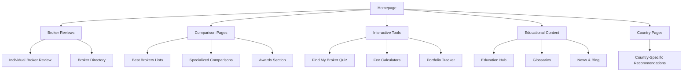

# Complete Site Pages - Product Requirements Document

## 1. Product Overview

The BrokerAnalysis platform requires a comprehensive site structure with 100+ pages covering broker reviews, comparison tools, educational content, and interactive features. This document outlines the complete page architecture based on the site map analysis, ensuring all content is accessible, SEO-optimized, and properly integrated with the existing homepage and navigation system.

## 2. Core Features

### 2.1 User Roles

| Role            | Registration Method      | Core Permissions                                                         |
| --------------- | ------------------------ | ------------------------------------------------------------------------ |
| Anonymous User  | No registration required | Can browse all content, use calculators, take quiz                       |
| Registered User | Email registration       | Can save searches, bookmark brokers, access personalized recommendations |
| Premium User    | Subscription upgrade     | Access to advanced tools, detailed analytics, priority support           |

### 2.2 Feature Module

Our complete site structure consists of the following main page categories:

1. **Broker Reviews Section**: Individual review pages for 50+ brokers, broker listing directory
2. **Comparison Pages**: Best brokers toplists, specialized comparison pages, awards section
3. **Interactive Tools**: Find My Broker quiz, fee calculators, portfolio tracker
4. **Educational Content**: Education hub, glossaries, news and blog section
5. **Country-Specific Pages**: Localized broker recommendations for 8+ countries
6. **Company Pages**: About us, methodology, team, careers, contact
7. **Legal Pages**: Terms, privacy policy, cookie policy, disclaimers

### 2.3 Page Details

| Page Category       | Module Name             | Feature Description                                                                                                     |
| ------------------- | ----------------------- | ----------------------------------------------------------------------------------------------------------------------- |
| Broker Reviews      | Individual Review Pages | Generate comprehensive review pages for 50+ brokers including fees, features, pros/cons, ratings, and detailed analysis |
| Broker Reviews      | Broker Directory        | Create main listing page with search, filters, and summary cards for all reviewed brokers                               |
| Comparison Pages    | Best Brokers Toplists   | Generate "Best Online Brokers 2025", "Best Stock Brokers", "Best Forex Brokers" with rankings and comparison tables     |
| Comparison Pages    | Specialized Lists       | Create niche comparison pages like "Best for Day Trading", "Best for Beginners", "Best Trading Platforms"               |
| Comparison Pages    | Awards Section          | Generate annual awards page with category winners and detailed explanations                                             |
| Interactive Tools   | Find My Broker Quiz     | Create questionnaire tool with personalized broker recommendations based on user preferences                            |
| Interactive Tools   | Fee Calculators         | Build stock trading and forex fee comparison calculators with real-time broker data                                     |
| Interactive Tools   | Portfolio Tracker       | Develop tool for tracking investments across multiple brokers                                                           |
| Educational Content | Education Hub           | Create learning center with categories for stocks, forex, crypto, options, commodities                                  |
| Educational Content | Glossaries              | Build comprehensive financial and forex trading glossaries with search functionality                                    |
| Educational Content | News & Blog             | Generate news section with market updates, broker announcements, and educational articles                               |
| Country Pages       | Localized Content       | Create country-specific pages for US, UK, India, Singapore, Australia, Malaysia, Canada, Philippines                    |
| Company Pages       | About Section           | Generate company information pages including methodology, team, careers, and contact                                    |
| Legal Pages         | Legal Documentation     | Create terms of service, privacy policy, cookie policy, and disclaimer pages                                            |

## 3. Core Process

### User Navigation Flow

**Anonymous User Flow:**

1. User lands on homepage with featured brokers and main navigation
2. User can browse broker reviews, comparison pages, or use interactive tools
3. User accesses educational content and country-specific recommendations
4. User can register for personalized features or continue browsing

**Registered User Flow:**

1. User logs in and sees personalized homepage with saved searches and recommendations
2. User accesses advanced features like saved broker comparisons and portfolio tracking
3. User receives personalized broker suggestions based on profile and preferences
4. User can upgrade to premium for additional features

## 4. User Interface Design

### 4.1 Design Style

* **Primary Colors**: Blue (#2563eb), White (#ffffff)

* **Secondary Colors**: Gray (#6b7280), Green (#10b981) for positive indicators

* **Button Style**: Rounded corners with hover effects, gradient backgrounds for CTAs

* **Font**: Inter for headings, system fonts for body text, sizes 14px-48px

* **Layout Style**: Card-based design with clean spacing, responsive grid system

* **Icons**: Heroicons for consistency, broker logos for brand recognition

### 4.2 Page Design Overview

| Page Category       | Module Name       | UI Elements                                                                                           |
| ------------------- | ----------------- | ----------------------------------------------------------------------------------------------------- |
| Broker Reviews      | Individual Review | Hero section with broker logo and rating, tabbed content sections, comparison tables, pros/cons cards |
| Broker Reviews      | Directory Listing | Search bar with filters, broker cards grid, pagination, sorting options                               |
| Comparison Pages    | Toplist Pages     | Ranking tables with scores, feature comparison matrices, filter sidebar                               |
| Interactive Tools   | Quiz Interface    | Step-by-step form with progress indicator, result cards with broker recommendations                   |
| Interactive Tools   | Calculators       | Input forms with real-time calculations, comparison tables, visual charts                             |
| Educational Content | Learning Hub      | Category cards, article listings, search functionality, progress tracking                             |
| Country Pages       | Localized Content | Country flag headers, localized broker lists, regulatory information boxes                            |

### 4.3 Responsiveness

The platform is mobile-first with responsive design optimizing for desktop, tablet, and mobile experiences. Touch interactions are optimized for mobile users, with swipeable cards and touch-friendly buttons.

## 5. SEO and Content Strategy

### 5.1 SEO Requirements

* Each page must have unique meta titles, descriptions, and structured data

* Broker review pages include JSON-LD schema for financial services

* Comparison pages use table markup and FAQ schema

* All pages include Open Graph and Twitter Card meta tags

* Internal linking strategy connects related brokers and topics

### 5.2 Content Generation Strategy

* AI-powered content generation for broker reviews using real data

* Template-based approach for consistency across similar page types

* Regular content updates based on broker changes and market conditions

* User-generated content integration for reviews and ratings

## 6. Technical Implementation

### 6.1 Page Generation System

* Dynamic page generation using React components and data templates

* Content management system for easy updates and additions

* API integration for real-time broker data and pricing

* Caching strategy for improved performance

### 6.2 Navigation Integration

* Main navigation menu with dropdown categories

* Breadcrumb navigation for deep pages

* Related content suggestions on each page

* Search functionality across all content types

### 6.3 Performance Optimization

* Lazy loading for images and non-critical content

* Code splitting for faster initial page loads

* CDN integration for global content delivery

* Progressive Web App features for mobile users

