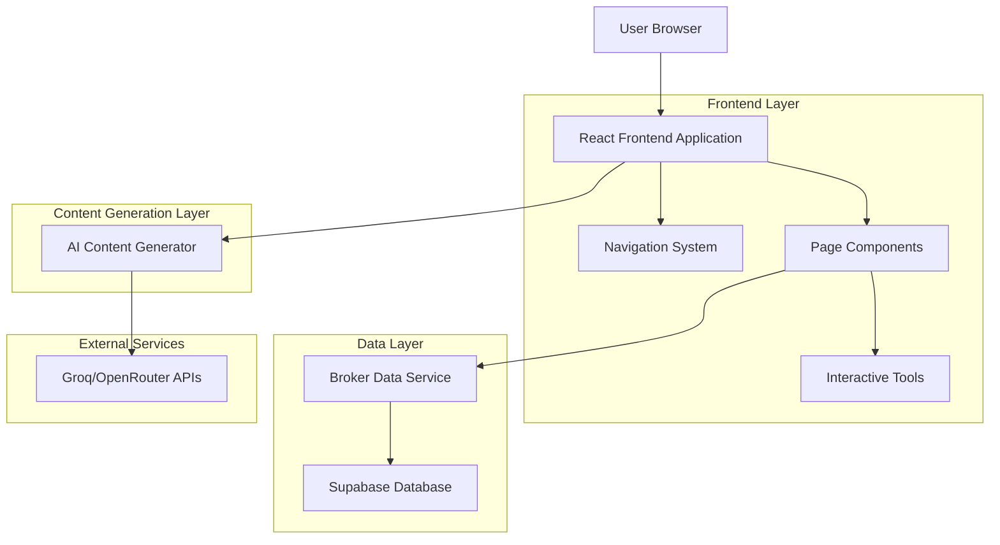
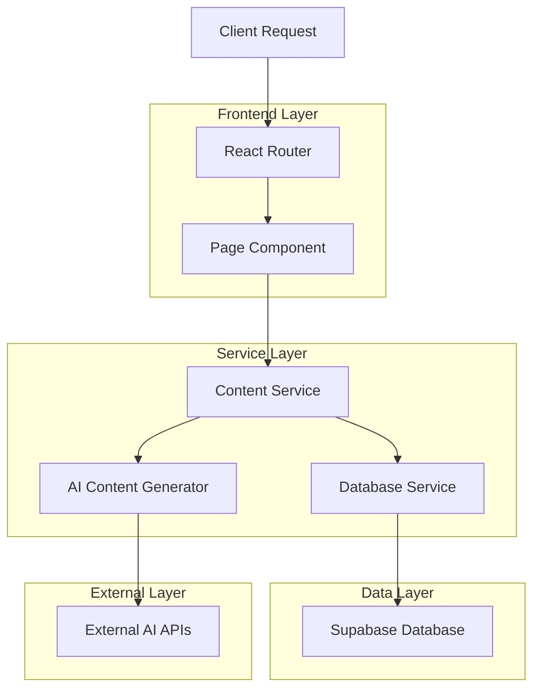
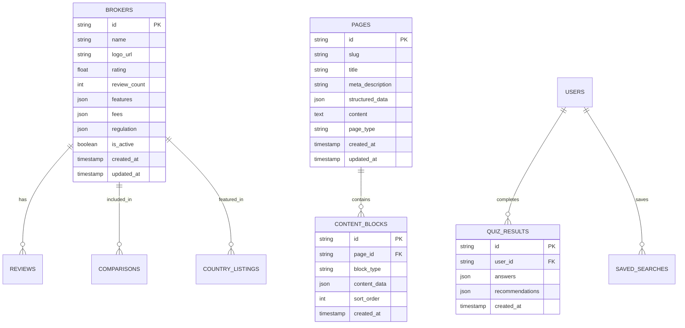

# Complete Site Technical Architecture Document

## 1. Architecture Design



## 2. Technology Description

* Frontend: React\@18 + TypeScript + Tailwind CSS + Vite

* Content Generation: AI Content Generator with Groq/OpenRouter integration

* Database: Supabase (PostgreSQL)

* Routing: React Router DOM

* State Management: React Context + Custom Hooks

* Styling: Tailwind CSS with custom components

## 3. Route Definitions

| Route                   | Purpose                                       |
| ----------------------- | --------------------------------------------- |
| /                       | Homepage with featured content and navigation |
| /brokers                | Broker directory listing page                 |
| /brokers/:id            | Individual broker review pages                |
| /best-online-brokers    | Best online brokers comparison page           |
| /best-stock-brokers     | Best stock brokers toplist                    |
| /best-forex-brokers     | Best forex brokers comparison                 |
| /best-cfd-brokers       | Best CFD brokers listing                      |
| /best-trading-platforms | Best trading platforms comparison             |
| /awards-2025            | BrokerChooser Awards 2025 page                |
| /best-for-day-trading   | Best brokers for day trading                  |
| /best-for-beginners     | Best brokers for beginners                    |
| /find-my-broker         | Interactive broker matching quiz              |
| /fee-calculator         | Stock trading fee calculator                  |
| /forex-calculator       | Forex fee calculator                          |
| /education              | Education hub main page                       |
| /education/stocks       | Stock trading education                       |
| /education/forex        | Forex trading education                       |
| /education/crypto       | Cryptocurrency education                      |
| /glossary               | Financial glossary                            |
| /forex-glossary         | Forex trading glossary                        |
| /news                   | News and blog section                         |
| /countries/us           | US-specific broker recommendations            |
| /countries/uk           | UK-specific broker recommendations            |
| /countries/india        | India-specific broker recommendations         |
| /countries/singapore    | Singapore-specific recommendations            |
| /countries/australia    | Australia-specific recommendations            |
| /countries/malaysia     | Malaysia-specific recommendations             |
| /countries/canada       | Canada-specific recommendations               |
| /countries/philippines  | Philippines-specific recommendations          |
| /about                  | About us page                                 |
| /methodology            | Our methodology page                          |
| /team                   | Our team page                                 |
| /careers                | Careers page                                  |
| /contact                | Contact page                                  |
| /for-businesses         | For businesses page                           |
| /terms                  | Terms and conditions                          |
| /privacy                | Privacy policy                                |
| /cookies                | Cookie policy                                 |

## 4. API Definitions

### 4.1 Content Generation API

**Generate Broker Review**

```
POST /api/content/broker-review
```

Request:

| Param Name | Param Type | isRequired | Description                                          |
| ---------- | ---------- | ---------- | ---------------------------------------------------- |
| brokerId   | string     | true       | Unique identifier for the broker                     |
| brokerData | object     | true       | Broker information and statistics                    |
| template   | string     | false      | Review template type (default, detailed, comparison) |

Response:

| Param Name  | Param Type | Description                           |
| ----------- | ---------- | ------------------------------------- |
| content     | string     | Generated HTML content for the review |
| metadata    | object     | SEO metadata and structured data      |
| lastUpdated | string     | Timestamp of content generation       |

**Generate Comparison Page**

```
POST /api/content/comparison
```

Request:

| Param Name | Param Type | isRequired | Description                                        |
| ---------- | ---------- | ---------- | -------------------------------------------------- |
| pageType   | string     | true       | Type of comparison (best-online, best-stock, etc.) |
| brokerList | array      | true       | List of brokers to include in comparison           |
| criteria   | object     | true       | Comparison criteria and weights                    |

Response:

| Param Name | Param Type | Description                        |
| ---------- | ---------- | ---------------------------------- |
| content    | string     | Generated comparison page content  |
| rankings   | array      | Ranked list of brokers with scores |
| metadata   | object     | SEO metadata and structured data   |

### 4.2 Interactive Tools API

**Broker Matching Quiz**

```
POST /api/tools/broker-quiz
```

Request:

| Param Name  | Param Type | isRequired | Description                 |
| ----------- | ---------- | ---------- | --------------------------- |
| answers     | object     | true       | User's quiz responses       |
| preferences | object     | false      | Additional user preferences |

Response:

| Param Name      | Param Type | Description                               |
| --------------- | ---------- | ----------------------------------------- |
| recommendations | array      | Matched brokers with compatibility scores |
| reasoning       | string     | Explanation of recommendations            |

**Fee Calculator**

```
POST /api/tools/fee-calculator
```

Request:

| Param Name | Param Type | isRequired | Description                        |
| ---------- | ---------- | ---------- | ---------------------------------- |
| tradeType  | string     | true       | Type of trade (stock, forex, etc.) |
| amount     | number     | true       | Trade amount                       |
| frequency  | number     | true       | Number of trades per month         |

Response:

| Param Name   | Param Type | Description                      |
| ------------ | ---------- | -------------------------------- |
| calculations | array      | Fee calculations for each broker |
| cheapest     | object     | Broker with lowest fees          |
| comparison   | object     | Detailed fee breakdown           |

## 5. Server Architecture Diagram



## 6. Data Model

### 6.1 Data Model Definition



### 6.2 Data Definition Language

**Brokers Table**

```sql
-- Create brokers table
CREATE TABLE brokers (
    id VARCHAR(255) PRIMARY KEY,
    name VARCHAR(255) NOT NULL,
    logo_url TEXT,
    rating DECIMAL(3,2),
    review_count INTEGER DEFAULT 0,
    features JSONB,
    fees JSONB,
    regulation JSONB,
    is_active BOOLEAN DEFAULT true,
    created_at TIMESTAMP WITH TIME ZONE DEFAULT NOW(),
    updated_at TIMESTAMP WITH TIME ZONE DEFAULT NOW()
);

-- Create indexes
CREATE INDEX idx_brokers_rating ON brokers(rating DESC);
CREATE INDEX idx_brokers_active ON brokers(is_active);
CREATE INDEX idx_brokers_name ON brokers(name);
```

**Pages Table**

```sql
-- Create pages table
CREATE TABLE pages (
    id UUID PRIMARY KEY DEFAULT gen_random_uuid(),
    slug VARCHAR(255) UNIQUE NOT NULL,
    title VARCHAR(255) NOT NULL,
    meta_description TEXT,
    structured_data JSONB,
    content TEXT,
    page_type VARCHAR(100),
    created_at TIMESTAMP WITH TIME ZONE DEFAULT NOW(),
    updated_at TIMESTAMP WITH TIME ZONE DEFAULT NOW()
);

-- Create indexes
CREATE INDEX idx_pages_slug ON pages(slug);
CREATE INDEX idx_pages_type ON pages(page_type);
CREATE INDEX idx_pages_updated ON pages(updated_at DESC);
```

**Content Blocks Table**

```sql
-- Create content_blocks table
CREATE TABLE content_blocks (
    id UUID PRIMARY KEY DEFAULT gen_random_uuid(),
    page_id UUID REFERENCES pages(id) ON DELETE CASCADE,
    block_type VARCHAR(100) NOT NULL,
    content_data JSONB,
    sort_order INTEGER DEFAULT 0,
    created_at TIMESTAMP WITH TIME ZONE DEFAULT NOW()
);

-- Create indexes
CREATE INDEX idx_content_blocks_page ON content_blocks(page_id);
CREATE INDEX idx_content_blocks_order ON content_blocks(page_id, sort_order);
```

**Quiz Results Table**

```sql
-- Create quiz_results table
CREATE TABLE quiz_results (
    id UUID PRIMARY KEY DEFAULT gen_random_uuid(),
    user_id UUID,
    answers JSONB NOT NULL,
    recommendations JSONB,
    created_at TIMESTAMP WITH TIME ZONE DEFAULT NOW()
);

-- Create indexes
CREATE INDEX idx_quiz_results_user ON quiz_results(user_id);
CREATE INDEX idx_quiz_results_created ON quiz_results(created_at DESC);
```

**Initial Data**

```sql
-- Insert sample page templates
INSERT INTO pages (slug, title, meta_description, page_type, content) VALUES
('best-online-brokers', 'Best Online Brokers 2025', 'Compare the top online brokers for 2025 with detailed reviews and rankings.', 'comparison', ''),
('best-stock-brokers', 'Best Stock Brokers 2025', 'Find the best stock brokers with low fees and advanced trading platforms.', 'comparison', ''),
('find-my-broker', 'Find My Broker Quiz', 'Take our interactive quiz to find the perfect broker for your trading needs.', 'tool', ''),
('education', 'Trading Education Hub', 'Learn about stocks, forex, crypto and more with our comprehensive guides.', 'education', '');
```

## 7. Content Generation Strategy

### 7.1 Page Generation Pipeline

1. **Template Selection**: Choose appropriate template based on page type
2. **Data Gathering**: Collect broker data, market information, and user preferences
3. **AI Content Generation**: Use Groq/OpenRouter APIs to generate content
4. **Quality Assurance**: Validate content for accuracy and completeness
5. **SEO Optimization**: Add metadata, structured data, and internal links
6. **Publishing**: Deploy content to production with proper routing

### 7.2 Content Update Strategy

* **Real-time Updates**: Broker data changes trigger content regeneration

* **Scheduled Updates**: Weekly updates for market-sensitive content

* **Manual Updates**: Editorial review for major broker changes

* **A/B Testing**: Test different content variations for optimization

## 8. Navigation Integration

### 8.1 Main Navigation Structure

```typescript
interface NavigationItem {
  label: string;
  href: string;
  children?: NavigationItem[];
}

const mainNavigation: NavigationItem[] = [
  {
    label: "Best Brokers",
    href: "/best-online-brokers",
    children: [
      { label: "Best Online Brokers", href: "/best-online-brokers" },
      { label: "Best Stock Brokers", href: "/best-stock-brokers" },
      { label: "Best Forex Brokers", href: "/best-forex-brokers" },
      { label: "Awards 2025", href: "/awards-2025" }
    ]
  },
  {
    label: "Broker Reviews",
    href: "/brokers",
    children: [
      { label: "All Brokers", href: "/brokers" },
      { label: "Interactive Brokers", href: "/brokers/interactive-brokers" },
      { label: "Charles Schwab", href: "/brokers/charles-schwab" }
    ]
  },
  {
    label: "Tools",
    href: "/find-my-broker",
    children: [
      { label: "Find My Broker", href: "/find-my-broker" },
      { label: "Fee Calculator", href: "/fee-calculator" },
      { label: "Forex Calculator", href: "/forex-calculator" }
    ]
  },
  {
    label: "Education",
    href: "/education",
    children: [
      { label: "Learning Hub", href: "/education" },
      { label: "Glossary", href: "/glossary" },
      { label: "News", href: "/news" }
    ]
  }
];
```

### 8.2 SEO and Performance Optimization

* **Lazy Loading**: Load content blocks as needed

* **Image Optimization**: WebP format with fallbacks

* **Code Splitting**: Split routes for faster loading

* **Caching Strategy**: Cache generated content with TTL

* \*\*Sit

