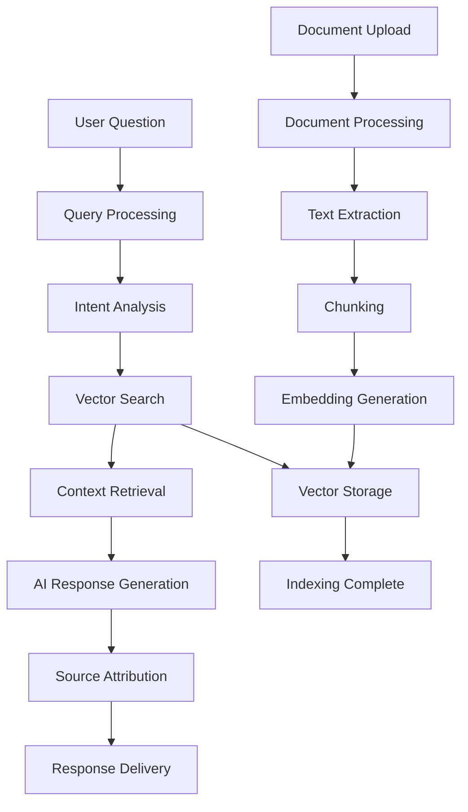

# RAG System Product Requirements Document

## Document Ingestion and Knowledge Base Enhancement

### Version: 1.0
### Date: January 2025
### Product: BrokerAnalysis Platform

---

## 1. Product Overview

The RAG (Retrieval-Augmented Generation) system will transform the BrokerAnalysis platform into an intelligent knowledge hub that can process, understand, and retrieve information from broker documents, regulatory files, news articles, and user reviews. This system will enable users to ask natural language questions and receive accurate, contextual answers backed by verified sources, significantly improving the platform's value proposition for broker research and analysis.

The RAG system addresses the core problem of information overload in broker analysis by making vast amounts of financial data instantly searchable and understandable through AI-powered conversations.

## 2. Core Features

### 2.1 User Roles

| Role | Registration Method | Core Permissions |
|------|---------------------|------------------|
| Free User | Email registration | Can ask basic questions, view 5 sources per day, access public documents |
| Premium User | Subscription upgrade | Unlimited questions, full source access, priority processing, advanced filters |
| Admin User | Internal invitation | Can upload documents, manage knowledge base, view analytics, moderate content |

### 2.2 Feature Module

Our RAG system requirements consist of the following main pages:

1. **AI Chat Interface**: Enhanced chatbot with contextual responses, source citations, conversation history, and smart suggestions.
2. **Document Library**: Document upload, processing status, search and filter, document management, and batch operations.
3. **Knowledge Base**: Organized document collections, topic categorization, search functionality, and content discovery.
4. **Analytics Dashboard**: Usage statistics, popular queries, document performance, and system health metrics.
5. **Settings Page**: RAG preferences, source filtering, privacy controls, and notification settings.

### 2.3 Page Details

| Page Name | Module Name | Feature description |
|-----------|-------------|---------------------|
| AI Chat Interface | Enhanced Chatbot | Ask questions in natural language, receive contextual answers with source citations, view conversation history, get smart question suggestions based on available documents |
| AI Chat Interface | Source Attribution | Display document sources for each response, show relevance scores, enable source document preview, provide direct links to original documents |
| AI Chat Interface | Context Management | Maintain conversation context across multiple questions, allow context clearing, enable topic switching, provide context-aware follow-up suggestions |
| Document Library | Document Upload | Upload PDF, HTML, and text documents, support batch uploads, show processing progress, validate document formats and size limits |
| Document Library | Processing Status | Real-time processing updates, error notifications, retry failed uploads, estimated completion times |
| Document Library | Document Management | View uploaded documents, edit metadata, delete documents, organize into collections, search and filter by type/date/status |
| Knowledge Base | Content Discovery | Browse documents by category (brokers, regulations, news, reviews), view popular content, explore related documents |
| Knowledge Base | Search Functionality | Full-text search across all documents, advanced filters (date, type, broker, topic), search suggestions and autocomplete |
| Knowledge Base | Topic Organization | Automatic document categorization, manual tagging, topic-based browsing, trending topics display |
| Analytics Dashboard | Usage Statistics | View query volume, popular questions, response accuracy metrics, user engagement data |
| Analytics Dashboard | Document Performance | Track document usage, identify high-value content, monitor processing success rates |
| Analytics Dashboard | System Health | Monitor RAG system performance, embedding generation status, vector database health |
| Settings Page | RAG Preferences | Configure response length, source count, similarity threshold, preferred document types |
| Settings Page | Privacy Controls | Manage document visibility, control data retention, export personal data, delete account data |
| Settings Page | Notification Settings | Configure processing notifications, system updates, usage alerts, weekly summaries |

## 3. Core Process

### 3.1 User Flow - Document Upload and Query

**Admin/Premium User Flow:**
1. User navigates to Document Library
2. Uploads documents (PDF, HTML, text files)
3. System processes documents (chunking, embedding, indexing)
4. User receives processing completion notification
5. User can now query the uploaded content through AI Chat
6. System provides contextual responses with source citations

**Free User Flow:**
1. User accesses AI Chat Interface
2. Asks questions about available public documents
3. Receives responses with limited source access (5 per day)
4. Can upgrade to Premium for unlimited access

### 3.2 System Flow - RAG Processing

## 4. User Interface Design

### 4.1 Design Style

**Primary Colors:**
- Primary Blue: #2563EB (trust, professionalism)
- Secondary Green: #059669 (success, accuracy)
- Accent Orange: #EA580C (highlights, CTAs)

**Button Style:**
- Rounded corners (8px border-radius)
- Subtle shadows for depth
- Hover animations and state changes
- Icon + text combinations

**Typography:**
- Primary Font: Inter (clean, readable)
- Headings: 24px, 20px, 18px, 16px
- Body Text: 14px, 16px
- Code/Technical: JetBrains Mono

**Layout Style:**
- Card-based design for content organization
- Sidebar navigation for main sections
- Responsive grid layouts
- Clean whitespace and visual hierarchy

**Icons and Animations:**
- Lucide React icons for consistency
- Subtle loading animations
- Progress indicators for processing
- Smooth transitions between states

### 4.2 Page Design Overview

| Page Name | Module Name | UI Elements |
|-----------|-------------|-------------|
| AI Chat Interface | Chat Container | Full-height chat window with message bubbles, input field with send button, typing indicators, message timestamps |
| AI Chat Interface | Source Panel | Collapsible sidebar showing document sources, relevance scores as progress bars, preview thumbnails, citation links |
| AI Chat Interface | Suggestion Cards | Horizontal scrollable cards with suggested questions, category-based grouping, click-to-ask functionality |
| Document Library | Upload Zone | Drag-and-drop area with file type icons, progress bars for uploads, batch upload support, file validation messages |
| Document Library | Document Grid | Card-based layout with document thumbnails, metadata overlays, status badges, action buttons (view, edit, delete) |
| Document Library | Filter Sidebar | Collapsible filters for type, date, status, search input with autocomplete, clear filters button |
| Knowledge Base | Category Navigation | Tree-view navigation with expandable categories, document counts, search within categories |
| Knowledge Base | Content Cards | Document preview cards with titles, excerpts, metadata, relevance indicators, quick actions |
| Analytics Dashboard | Metrics Cards | KPI cards with numbers, trends, sparkline charts, color-coded status indicators |
| Analytics Dashboard | Charts Section | Interactive charts for usage trends, document performance, system health with tooltips and legends |
| Settings Page | Settings Groups | Organized sections with clear labels, toggle switches, sliders, dropdown selects, help tooltips |

### 4.3 Responsiveness

The RAG system is designed mobile-first with desktop enhancement:

**Mobile (320px-768px):**
- Single column layouts
- Collapsible navigation
- Touch-optimized buttons (44px minimum)
- Swipe gestures for source browsing

**Tablet (768px-1024px):**
- Two-column layouts where appropriate
- Sidebar navigation
- Enhanced touch interactions
- Split-view for chat and sources

**Desktop (1024px+):**
- Multi-column layouts
- Persistent sidebars
- Keyboard shortcuts
- Hover states and tooltips
- Advanced filtering and sorting

## 5. Acceptance Criteria

### 5.1 Functional Requirements

**Document Processing:**
- [ ] Support PDF, HTML, and plain text document uploads
- [ ] Process documents up to 100MB in size
- [ ] Complete processing within 10 seconds for 10MB files
- [ ] Provide real-time processing status updates
- [ ] Handle batch uploads of up to 50 documents

**AI Chat Functionality:**
- [ ] Respond to natural language questions within 3 seconds
- [ ] Provide source citations for all factual claims
- [ ] Maintain conversation context across multiple exchanges
- [ ] Support follow-up questions and clarifications
- [ ] Offer smart question suggestions based on available content

**Search and Retrieval:**
- [ ] Return relevant results with >80% user satisfaction
- [ ] Support advanced filtering by document type, date, and topic
- [ ] Provide full-text search across all documents
- [ ] Enable semantic search for concept-based queries
- [ ] Display search results within 1 second

**User Management:**
- [ ] Enforce role-based access controls
- [ ] Track usage limits for free users (5 sources/day)
- [ ] Provide upgrade prompts for premium features
- [ ] Maintain user privacy and data protection

### 5.2 Performance Requirements

**Response Times:**
- Document upload: < 5 seconds for 10MB files
- Search queries: < 1 second average
- AI responses: < 3 seconds end-to-end
- Page load times: < 2 seconds

**Scalability:**
- Support 500+ concurrent users
- Handle 1000+ documents in knowledge base
- Process 10,000+ queries per day
- Maintain 99.9% system uptime

**Quality Metrics:**
- Search relevance: >80% user satisfaction
- Response accuracy: >90% factual correctness
- Source attribution: 100% traceable
- Error rate: <1% processing failures

### 5.3 Security and Privacy

**Data Protection:**
- [ ] Encrypt documents at rest and in transit
- [ ] Implement role-based access controls
- [ ] Provide audit logs for document access
- [ ] Support GDPR compliance (data export, deletion)

**User Privacy:**
- [ ] Allow users to control document visibility
- [ ] Provide data retention policy options
- [ ] Enable anonymous usage analytics
- [ ] Support account data deletion

## 6. Success Metrics

### 6.1 User Engagement

**Primary KPIs:**
- Daily Active Users (DAU) increase by 40%
- Average session duration increase by 60%
- Query volume: 1000+ queries per day
- User retention: 70% weekly retention

**Secondary KPIs:**
- Document upload rate: 100+ documents per week
- Premium conversion rate: 15% from free users
- User satisfaction score: >4.5/5.0
- Support ticket reduction: 30% decrease

### 6.2 System Performance

**Technical KPIs:**
- System availability: 99.9% uptime
- Average response time: <2 seconds
- Processing success rate: >99%
- Cost per query: <$0.05

**Quality KPIs:**
- Search relevance score: >0.8
- Response accuracy: >90%
- Source citation rate: 100%
- User feedback rating: >4.0/5.0

## 7. Risk Assessment

### 7.1 User Experience Risks

**High Priority:**
- **Poor Response Quality**: Implement quality scoring and feedback loops
- **Slow Performance**: Optimize caching and implement performance monitoring
- **Complex Interface**: Conduct user testing and iterative design improvements

**Medium Priority:**
- **Limited Document Support**: Prioritize most common formats first
- **Mobile Experience**: Ensure responsive design and touch optimization
- **Learning Curve**: Provide onboarding tutorials and help documentation

### 7.2 Business Risks

**Revenue Impact:**
- **Low Premium Conversion**: Implement freemium model with clear value proposition
- **High Operating Costs**: Monitor usage and implement cost controls
- **Competitive Pressure**: Focus on unique broker-specific features

**Operational Risks:**
- **Content Quality**: Implement document validation and quality checks
- **Legal Compliance**: Ensure proper licensing and attribution
- **Data Security**: Implement comprehensive security measures

## 8. Launch Strategy

### 8.1 Phased Rollout

**Phase 1: Beta Launch (Week 8)**
- Limited user group (50 beta testers)
- Core functionality: document upload, basic chat
- Feedback collection and iteration

**Phase 2: Soft Launch (Week 10)**
- Expand to 500 users
- Full feature set with premium tiers
- Performance optimization

**Phase 3: Full Launch (Week 12)**
- Public availability
- Marketing campaign
- Customer support scaling

### 8.2 Success Criteria for Launch

**Technical Readiness:**
- [ ] All acceptance criteria met
- [ ] Performance benchmarks achieved
- [ ] Security audit completed
- [ ] Load testing passed

**Business Readiness:**
- [ ] Pricing strategy finalized
- [ ] Customer support trained
- [ ] Marketing materials prepared
- [ ] Legal compliance verified

## 9. Future Enhancements

### 9.1 Advanced Features (Post-Launch)

**Q2 2025:**
- Multi-language document support
- Advanced analytics and insights
- API access for enterprise users
- Integration with external data sources

**Q3 2025:**
- Visual document analysis (charts, graphs)
- Automated document categorization
- Machine learning model fine-tuning
- Advanced collaboration features

**Q4 2025:**
- Real-time document monitoring
- Predictive analytics
- Custom AI model training
- Enterprise SSO integration

### 9.2 Platform Integration

**Homepage Integration:**
- Featured RAG insights on homepage
- Quick access to popular queries
- Document recommendation engine
- Personalized content discovery

**Broker Comparison Enhancement:**
- RAG-powered broker comparisons
- Automated fact-checking
- Dynamic comparison criteria
- Real-time data integration

## 10. Conclusion

The RAG system represents a significant enhancement to the BrokerAnalysis platform, transforming it from a static information repository into an intelligent, conversational knowledge hub. By implementing this system according to the specifications outlined in this document, we will:

1. **Improve User Experience**: Enable natural language interactions with complex financial data
2. **Increase Platform Value**: Provide instant access to verified, contextual information
3. **Drive User Engagement**: Create compelling reasons for users to return and upgrade
4. **Establish Competitive Advantage**: Differentiate through AI-powered broker analysis

**Key Success Factors:**
- Focus on user experience and response quality
- Implement robust performance monitoring
- Maintain high security and privacy standards
- Provide clear value proposition for premium features
- Continuously iterate based on user feedback

The successful implementation of this RAG system will position BrokerAnalysis as the leading AI-powered platform for broker research and analysis, setting the foundation for future innovations in financial technology.