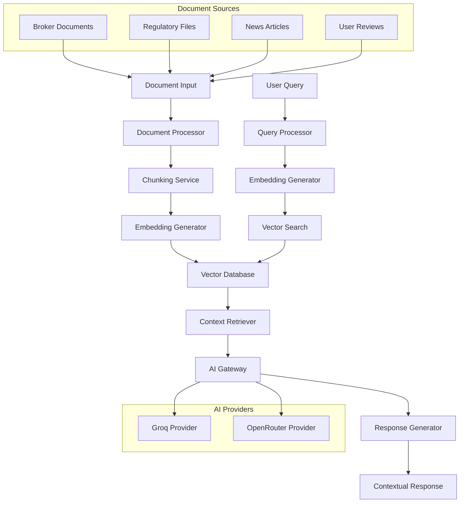

# RAG System Technical Specification

## Document Ingestion and Retrieval-Augmented Generation Implementation

### Version: 1.0
### Date: January 2025
### Status: Technical Specification

---

## 1. Executive Summary

This document provides a comprehensive technical specification for implementing Requirement 4: Document Ingestion and RAG System for the BrokerAnalysis platform. The RAG system will enable intelligent document processing, knowledge base creation, and contextual AI responses by integrating with the existing multi-provider AI architecture (Groq and OpenRouter).

## 2. Current State Analysis

### 2.1 Existing AI Infrastructure

**Strengths:**
- ✅ Multi-provider AI architecture with Groq and OpenRouter
- ✅ AIGateway singleton pattern for centralized AI management
- ✅ Comprehensive AI types and interfaces defined
- ✅ Provider fallback mechanisms configured
- ✅ Cost tracking and rate limiting infrastructure
- ✅ Model-specific configurations for different use cases

**Current Limitations:**
- ❌ No vector database integration
- ❌ No document processing pipeline
- ❌ No embedding generation capabilities
- ❌ No chunking strategies implemented
- ❌ No retrieval mechanisms for contextual responses
- ❌ AIGateway contains only placeholder implementations

### 2.2 Available MCP Servers

**Relevant for RAG Implementation:**
- **Context7 MCP**: Library documentation and context retrieval
- **Sequential Thinking MCP**: Structured reasoning for complex document analysis
- **Fetch MCP**: Web content retrieval for document ingestion

**Missing RAG-Specific Servers:**
- Vector database MCP (Qdrant, Pinecone, or Weaviate)
- Document processing MCP
- Embedding generation MCP

## 3. Technical Architecture

### 3.1 System Overview



### 3.2 Core Components

#### 3.2.1 Document Processing Pipeline

**DocumentProcessor Class**
```typescript
interface DocumentProcessor {
  processDocument(document: RawDocument): Promise<ProcessedDocument>;
  extractMetadata(document: RawDocument): DocumentMetadata;
  validateDocument(document: RawDocument): ValidationResult;
}
```

**Supported Document Types:**
- PDF files (broker prospectuses, regulatory documents)
- HTML content (web pages, news articles)
- Plain text (reviews, comments)
- Structured data (JSON, CSV broker data)

#### 3.2.2 Chunking Strategy

**ChunkingService Class**
```typescript
interface ChunkingService {
  chunkDocument(document: ProcessedDocument, strategy: ChunkingStrategy): DocumentChunk[];
  optimizeChunks(chunks: DocumentChunk[]): DocumentChunk[];
}

type ChunkingStrategy = 
  | 'fixed-size'      // 512-1024 tokens per chunk
  | 'semantic'        // Sentence/paragraph boundaries
  | 'hierarchical'    // Section-based chunking
  | 'sliding-window'; // Overlapping chunks
```

**Chunking Parameters:**
- **Chunk Size**: 512-1024 tokens (optimal for embedding models)
- **Overlap**: 50-100 tokens between chunks
- **Metadata Preservation**: Document source, section, timestamp

#### 3.2.3 Embedding Generation

**EmbeddingService Class**
```typescript
interface EmbeddingService {
  generateEmbeddings(chunks: DocumentChunk[]): Promise<EmbeddingResult[]>;
  generateQueryEmbedding(query: string): Promise<number[]>;
}
```

**Embedding Models:**
- **Primary**: OpenAI text-embedding-3-small (1536 dimensions)
- **Fallback**: Sentence Transformers all-MiniLM-L6-v2 (384 dimensions)
- **Cost Optimization**: Use smaller models for non-critical content

#### 3.2.4 Vector Database Integration

**VectorStore Interface**
```typescript
interface VectorStore {
  upsertDocuments(documents: EmbeddedDocument[]): Promise<void>;
  searchSimilar(query: number[], options: SearchOptions): Promise<SearchResult[]>;
  deleteDocuments(documentIds: string[]): Promise<void>;
  getDocumentMetadata(documentId: string): Promise<DocumentMetadata>;
}
```

**Recommended Vector Database: Qdrant**
- **Rationale**: Open source, high performance, excellent TypeScript support
- **Deployment**: Docker container for development, cloud for production
- **Configuration**: Collections per document type (brokers, regulations, news)

### 3.3 Integration with Existing AI Architecture

#### 3.3.1 Enhanced AIGateway

```typescript
class AIGateway {
  private ragService: RAGService;
  private vectorStore: VectorStore;
  
  async chatWithContext(request: ChatRequest): Promise<ChatResponse> {
    // 1. Extract query intent
    const intent = await this.analyzeIntent(request.message);
    
    // 2. Retrieve relevant context if needed
    if (intent.requiresContext) {
      const context = await this.ragService.retrieveContext(request.message);
      request.context = context;
    }
    
    // 3. Generate response with context
    return this.generateContextualResponse(request);
  }
}
```

#### 3.3.2 RAG Service Implementation

```typescript
class RAGService {
  async retrieveContext(query: string, options?: RetrievalOptions): Promise<RetrievalContext> {
    // 1. Generate query embedding
    const queryEmbedding = await this.embeddingService.generateQueryEmbedding(query);
    
    // 2. Search vector database
    const searchResults = await this.vectorStore.searchSimilar(queryEmbedding, {
      limit: options?.maxResults || 5,
      threshold: options?.similarityThreshold || 0.7
    });
    
    // 3. Rank and filter results
    const rankedResults = await this.rankResults(searchResults, query);
    
    // 4. Prepare context for AI model
    return this.formatContext(rankedResults);
  }
}
```

## 4. Implementation Roadmap

### Phase 1: Foundation (Weeks 1-2)

**Week 1: Core Infrastructure**
- [ ] Set up Qdrant vector database (Docker + cloud deployment)
- [ ] Implement DocumentProcessor base class
- [ ] Create EmbeddingService with OpenAI integration
- [ ] Design VectorStore interface and Qdrant implementation

**Week 2: Document Processing**
- [ ] Implement ChunkingService with multiple strategies
- [ ] Create document type handlers (PDF, HTML, text)
- [ ] Build metadata extraction pipeline
- [ ] Implement document validation and sanitization

### Phase 2: RAG Core (Weeks 3-4)

**Week 3: Retrieval System**
- [ ] Implement RAGService class
- [ ] Create similarity search algorithms
- [ ] Build context ranking and filtering
- [ ] Implement query intent analysis

**Week 4: AI Integration**
- [ ] Enhance AIGateway with RAG capabilities
- [ ] Implement contextual response generation
- [ ] Add source attribution and citation
- [ ] Create fallback mechanisms for RAG failures

### Phase 3: Document Ingestion (Weeks 5-6)

**Week 5: Ingestion Pipeline**
- [ ] Build document upload and processing API
- [ ] Implement batch processing for large documents
- [ ] Create document update and versioning system
- [ ] Add progress tracking and error handling

**Week 6: Content Sources**
- [ ] Integrate broker document ingestion
- [ ] Add regulatory document processing
- [ ] Implement news article ingestion
- [ ] Create user review processing pipeline

### Phase 4: Optimization & Testing (Weeks 7-8)

**Week 7: Performance Optimization**
- [ ] Implement caching strategies
- [ ] Optimize embedding generation
- [ ] Add parallel processing capabilities
- [ ] Performance testing and tuning

**Week 8: Quality Assurance**
- [ ] Comprehensive testing suite
- [ ] Integration testing with AI providers
- [ ] Load testing and scalability validation
- [ ] Security and privacy compliance

## 5. Data Models and Schemas

### 5.1 Document Types

```typescript
interface RawDocument {
  id: string;
  type: DocumentType;
  source: string;
  content: string | Buffer;
  metadata: RawDocumentMetadata;
  uploadedAt: Date;
}

interface ProcessedDocument {
  id: string;
  originalId: string;
  type: DocumentType;
  content: string;
  metadata: DocumentMetadata;
  processedAt: Date;
  processingVersion: string;
}

interface DocumentChunk {
  id: string;
  documentId: string;
  content: string;
  embedding?: number[];
  metadata: ChunkMetadata;
  position: ChunkPosition;
}

interface EmbeddedDocument {
  id: string;
  chunks: DocumentChunk[];
  metadata: DocumentMetadata;
  embeddingModel: string;
  createdAt: Date;
}
```

### 5.2 Search and Retrieval

```typescript
interface SearchOptions {
  limit?: number;
  threshold?: number;
  filters?: SearchFilters;
  includeMetadata?: boolean;
}

interface SearchResult {
  documentId: string;
  chunkId: string;
  content: string;
  score: number;
  metadata: ChunkMetadata;
}

interface RetrievalContext {
  sources: ContextSource[];
  totalSources: number;
  averageRelevance: number;
  query: string;
  retrievedAt: Date;
}
```

## 6. Vector Database Configuration

### 6.1 Qdrant Setup

**Docker Configuration:**
```yaml
version: '3.8'
services:
  qdrant:
    image: qdrant/qdrant:latest
    ports:
      - "6333:6333"
      - "6334:6334"
    volumes:
      - qdrant_storage:/qdrant/storage
    environment:
      - QDRANT__SERVICE__HTTP_PORT=6333
      - QDRANT__SERVICE__GRPC_PORT=6334
```

**Collection Schema:**
```typescript
const collectionConfig = {
  vectors: {
    size: 1536, // OpenAI text-embedding-3-small
    distance: 'Cosine'
  },
  payload_schema: {
    document_type: 'keyword',
    source: 'keyword',
    broker_id: 'keyword',
    created_at: 'datetime',
    chunk_index: 'integer'
  }
};
```

### 6.2 Collection Strategy

**Separate Collections by Document Type:**
- `broker_documents`: Broker prospectuses, fact sheets
- `regulatory_documents`: Compliance documents, regulations
- `news_articles`: Market news, broker announcements
- `user_reviews`: User reviews and ratings
- `general_knowledge`: FAQ, help documentation

## 7. Integration Points

### 7.1 Existing AI Providers

**Groq Integration:**
- Use `deepseek-r1-distill-llama-70b` for complex reasoning with context
- Use `gemma2-9b-it` for fast contextual responses
- Implement context window management (8K-32K tokens)

**OpenRouter Integration:**
- Use `deepseek/deepseek-r1:free` as cost-effective fallback
- Use `moonshotai/kimi-k2:free` for quick responses
- Implement free model prioritization for cost optimization

### 7.2 Frontend Integration

**React Components:**
```typescript
// Enhanced chatbot with RAG context
const AIChat = () => {
  const [showSources, setShowSources] = useState(false);
  
  return (
    <div className="ai-chat">
      <ChatMessages messages={messages} />
      {lastResponse.sources && (
        <SourceAttribution 
          sources={lastResponse.sources}
          visible={showSources}
        />
      )}
    </div>
  );
};
```

### 7.3 API Endpoints

```typescript
// Document ingestion
POST /api/rag/documents
PUT /api/rag/documents/:id
DELETE /api/rag/documents/:id

// Search and retrieval
GET /api/rag/search?q={query}&limit={limit}
POST /api/rag/chat

// Management
GET /api/rag/status
POST /api/rag/reindex
```

## 8. Testing Strategy

### 8.1 Unit Testing

**Document Processing Tests:**
```typescript
describe('DocumentProcessor', () => {
  it('should extract text from PDF documents', async () => {
    const processor = new DocumentProcessor();
    const result = await processor.processDocument(mockPdfDocument);
    expect(result.content).toContain('expected text');
  });
  
  it('should handle malformed documents gracefully', async () => {
    const processor = new DocumentProcessor();
    await expect(processor.processDocument(malformedDoc))
      .rejects.toThrow('Invalid document format');
  });
});
```

**RAG Service Tests:**
```typescript
describe('RAGService', () => {
  it('should retrieve relevant context for broker queries', async () => {
    const ragService = new RAGService(mockVectorStore);
    const context = await ragService.retrieveContext('best forex brokers');
    expect(context.sources).toHaveLength(5);
    expect(context.averageRelevance).toBeGreaterThan(0.7);
  });
});
```

### 8.2 Integration Testing

**End-to-End RAG Flow:**
```typescript
describe('RAG Integration', () => {
  it('should process document and enable retrieval', async () => {
    // 1. Upload document
    const uploadResult = await uploadDocument(testDocument);
    
    // 2. Wait for processing
    await waitForProcessing(uploadResult.id);
    
    // 3. Query for content
    const response = await aiGateway.chatWithContext({
      message: 'What are the fees for this broker?'
    });
    
    // 4. Verify context was used
    expect(response.sources).toBeDefined();
    expect(response.content).toContain('fee information');
  });
});
```

### 8.3 Performance Testing

**Load Testing Scenarios:**
- Concurrent document uploads (100+ documents)
- High-frequency search queries (1000+ queries/minute)
- Large document processing (100MB+ files)
- Vector database performance under load

## 9. Performance and Scalability

### 9.1 Performance Targets

**Response Times:**
- Document upload: < 5 seconds for 10MB files
- Search queries: < 500ms for similarity search
- Context retrieval: < 1 second for 5 sources
- End-to-end RAG response: < 3 seconds

**Throughput:**
- Document processing: 100 documents/hour
- Search queries: 1000 queries/minute
- Concurrent users: 500+ simultaneous users

### 9.2 Scalability Considerations

**Horizontal Scaling:**
- Stateless service design for easy scaling
- Load balancing for API endpoints
- Distributed vector database clusters
- Async processing queues for document ingestion

**Caching Strategy:**
```typescript
interface CacheStrategy {
  embeddings: {
    ttl: '24h',
    storage: 'redis',
    keyPattern: 'embedding:{hash}'
  },
  searchResults: {
    ttl: '1h',
    storage: 'memory',
    maxSize: '100MB'
  },
  documents: {
    ttl: '7d',
    storage: 'redis',
    compression: true
  }
}
```

### 9.3 Resource Optimization

**Memory Management:**
- Streaming document processing for large files
- Batch embedding generation
- Connection pooling for database operations
- Garbage collection optimization

**Cost Optimization:**
- Embedding model selection based on content importance
- Batch processing to reduce API calls
- Intelligent caching to minimize redundant operations
- Free model prioritization for non-critical queries

## 10. Security and Privacy

### 10.1 Data Protection

**Document Security:**
- Encryption at rest for sensitive documents
- Access control based on user permissions
- Audit logging for document access
- Automatic PII detection and redaction

**API Security:**
```typescript
interface SecurityConfig {
  authentication: {
    required: true,
    methods: ['jwt', 'api-key']
  },
  rateLimit: {
    windowMs: 60000,
    maxRequests: 100
  },
  validation: {
    inputSanitization: true,
    outputFiltering: true
  }
}
```

### 10.2 Privacy Compliance

**GDPR Compliance:**
- Right to deletion: Remove user documents and embeddings
- Data portability: Export user's document data
- Consent management: Track document processing consent
- Privacy by design: Minimize data collection

**Data Retention:**
- Document retention policies (configurable)
- Automatic cleanup of expired embeddings
- Audit trail retention (7 years)
- User data anonymization options

## 11. Monitoring and Observability

### 11.1 Metrics and KPIs

**System Metrics:**
```typescript
interface RAGMetrics {
  documents: {
    totalProcessed: number,
    processingRate: number,
    errorRate: number
  },
  search: {
    queriesPerSecond: number,
    averageLatency: number,
    relevanceScore: number
  },
  costs: {
    embeddingCosts: number,
    storageCosts: number,
    computeCosts: number
  }
}
```

**Quality Metrics:**
- Search relevance scores
- User satisfaction ratings
- Context utilization rates
- Source attribution accuracy

### 11.2 Alerting and Monitoring

**Critical Alerts:**
- Vector database connectivity issues
- Embedding service failures
- High error rates in document processing
- Cost threshold breaches

**Dashboard Components:**
- Real-time processing status
- Search performance metrics
- Cost tracking and projections
- System health indicators

## 12. Deployment and DevOps

### 12.1 Environment Configuration

**Development Environment:**
```yaml
# docker-compose.dev.yml
version: '3.8'
services:
  qdrant:
    image: qdrant/qdrant:latest
    ports: ["6333:6333"]
    volumes: ["./data/qdrant:/qdrant/storage"]
  
  redis:
    image: redis:alpine
    ports: ["6379:6379"]
    
  app:
    build: .
    environment:
      - NODE_ENV=development
      - QDRANT_URL=http://qdrant:6333
      - REDIS_URL=redis://redis:6379
```

**Production Environment:**
- Managed Qdrant Cloud instance
- Redis cluster for caching
- Load balancers for API endpoints
- CDN for document delivery

### 12.2 CI/CD Pipeline

**Build Pipeline:**
```yaml
# .github/workflows/rag-system.yml
name: RAG System CI/CD
on: [push, pull_request]

jobs:
  test:
    runs-on: ubuntu-latest
    services:
      qdrant:
        image: qdrant/qdrant:latest
        ports: ["6333:6333"]
    
    steps:
      - uses: actions/checkout@v3
      - name: Setup Node.js
        uses: actions/setup-node@v3
        with:
          node-version: '18'
      
      - name: Install dependencies
        run: npm ci
      
      - name: Run tests
        run: npm run test:rag
        env:
          QDRANT_URL: http://localhost:6333
      
      - name: Build application
        run: npm run build
```

## 13. Risk Assessment and Mitigation

### 13.1 Technical Risks

**High Priority Risks:**

1. **Vector Database Performance Degradation**
   - *Risk*: Slow search performance with large datasets
   - *Mitigation*: Implement indexing optimization, query caching, and horizontal scaling
   - *Monitoring*: Track query latency and implement alerts

2. **Embedding Model API Failures**
   - *Risk*: OpenAI API downtime affecting document processing
   - *Mitigation*: Implement multiple embedding providers, local model fallback
   - *Monitoring*: Health checks and automatic failover

3. **Context Window Limitations**
   - *Risk*: Large contexts exceeding AI model limits
   - *Mitigation*: Intelligent context truncation, summarization, and chunking
   - *Monitoring*: Track context sizes and truncation rates

### 13.2 Business Risks

**Medium Priority Risks:**

1. **Cost Escalation**
   - *Risk*: High embedding and storage costs
   - *Mitigation*: Cost monitoring, budget alerts, free model prioritization
   - *Monitoring*: Real-time cost tracking and projections

2. **Data Quality Issues**
   - *Risk*: Poor document quality affecting RAG performance
   - *Mitigation*: Document validation, quality scoring, manual review processes
   - *Monitoring*: Quality metrics and user feedback tracking

## 14. Success Criteria and Acceptance

### 14.1 Functional Requirements

**Must Have (P0):**
- [ ] Document upload and processing pipeline
- [ ] Vector search with similarity scoring
- [ ] Contextual AI responses with source attribution
- [ ] Integration with existing AI providers
- [ ] Basic document types support (PDF, HTML, text)

**Should Have (P1):**
- [ ] Advanced chunking strategies
- [ ] Multi-language document support
- [ ] Real-time document updates
- [ ] Advanced search filters
- [ ] Performance optimization

**Could Have (P2):**
- [ ] Visual document analysis
- [ ] Automated document categorization
- [ ] Advanced analytics dashboard
- [ ] Machine learning model fine-tuning

### 14.2 Performance Acceptance Criteria

**Response Time Requirements:**
- Document processing: < 10 seconds for 10MB files
- Search queries: < 1 second average response time
- RAG responses: < 5 seconds end-to-end
- System availability: 99.9% uptime

**Quality Requirements:**
- Search relevance: > 80% user satisfaction
- Context accuracy: > 90% factual correctness
- Source attribution: 100% traceable sources
- Error rate: < 1% processing failures

## 15. Conclusion

This technical specification provides a comprehensive roadmap for implementing a robust RAG system that integrates seamlessly with the existing BrokerAnalysis AI architecture. The phased approach ensures manageable development cycles while delivering incremental value to users.

**Key Success Factors:**
1. Leveraging existing AI provider infrastructure
2. Implementing robust error handling and fallback mechanisms
3. Focusing on performance and scalability from the start
4. Maintaining strong security and privacy standards
5. Continuous monitoring and optimization

**Next Steps:**
1. Review and approve this technical specification
2. Set up development environment with Qdrant
3. Begin Phase 1 implementation
4. Establish monitoring and testing frameworks
5. Plan user acceptance testing and feedback collection

The implementation of this RAG system will significantly enhance the BrokerAnalysis platform's ability to provide intelligent, contextual responses while maintaining the high standards of performance and reliability expected by users.